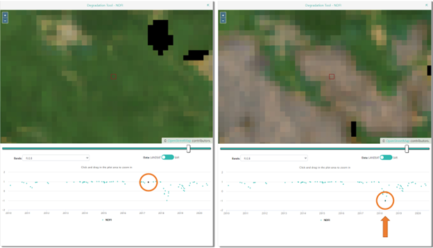

Geo-Dash interface
==================

For some projects, a second page or tab will open automatically when you go to your first plot. This is the **Geo-Dash interface**. Many different elements can be displayed on this interface, depending on what the Institution has set up.

Some of the most commonly used indexes are described here. If your Institution has set up the project with a more complicated **Geo-Dash interface**, contact them for more information on how to use the information provided to assist data collection and photo interpretation.

The normalized difference vegetation index (NDVI) is used to determine if an area contains live green vegetation. In map based representations, dead plants and inanimate objects are represented in one color, while live healthy plants are represented as another color. Which colors these are depends on how your institution has set up the project you’re working on. You can use the slider on the NDVI widget to compare the NDVI values with satellite imagery. In numerical representations (e.g. time series graphs) of most natural environments, values below 0 represent dead plants or inanimate objects, 0-0.33 represents unhealthy plants, 0.33-0.66 represents moderately healthy plants, and 0.66-1 represents very healthy plants.

The enhanced vegetation index (EVI) and two-band EVI (EVI 2) are optimized vegetation indexes. They are designed to have higher sensitivity in high biomass regions (e.g. along the equator). As with NDVI, dead plants and inanimate objects are represented in one color, while live healthy plants are represented as another color. Which colors these are depends on how your institution has set up the project you’re working on. You can use the slider on the EVI widget to compare the EVI values with satellite imagery. The index varies between 0-1, with 0 representing dead plants and 1 representing very healthy plants.

The normalized difference moisture index (NDMI) is used to determine the water content of vegetation. Values near -1 indicate plants with low moisture while values near 1 indicate plants with high moisture.

The normalized difference water index (NDWI) is also related to plant water content and plant water stress. Values near -1 indicate low water content and vegetation cover and values near 1 indicate high water content and vegetation cover.

Some projects may set up imagery from two time periods, so you can easily view them side by side.

Geo-Dash degradation tool
-------------------------

Your institution may have set up the forest degradation tool in the Geo-Dash interface. This tool provides time series information on forest degradation from selective logging, fire, and other large and small disturbances. Broadly, you can use this tool to observe sharp and gradual changes in the NDFI metric (shown in the bottom panel) and click between the date points to visually confirm the change via imagery (shown in the top panel).

More specifically, the **top panel** is the imagery panel. Imagery will display here over the OpenStreetMap data when you select a specific date in the **bottom panel**. The **slider bar** allows you to choose the opacity of your imagery. Under **Band Combination**, 321 stands for true color composite (R,G,B) and 543 stands for false color composite (SWIR, NIR, R). Using the **Data** toggle, you can choose between Landsat or SAR data. 

The **bottom panel** shows a time series graph of NDFI (most common) or another metric. The time series graph is averaged over the plot (not sample) area. Values of NDFI between -1 and 0 generally indicate areas that have been logged (and burned, most likely). Values of NDFI near +1 indicate intact forest. Values near .5 suggest selective logging or diffuse canopy damage. Each dot represents one time period where there are data for your sample plot.

To use this tool:

1. Move the toggle to the imagery **Data** you would like to see: LANDSAT or SAR.
2. If you have chosen LANDSAT, choose the **Band Combination** you would like.
3. Pause while the time series graph loads.
4. Examine the time series graph for any cyclical patterns (indicating seasonal changes). These are present in deciduous forests, but might not be present (e.g. in the Amazon rainforest).
5. Then, look for any abrupt changes (usually sharp degreases) or gradual changes (usually gradual increases). These indicate potential degradation & recovery events.
6. Click on an individual date (blue circle) on the graph in order to bring up imagery for that time period. You may have to wait for the imagery to load.
7. Click between different dates on and around your suspected event to visually confirm that an event happened and determine the type of event. Here are some examples:

   - A sharp decrease in NDFI (often accompanied by a gradual recovery) may indicate selective logging. The left panel shows the landscape before; the right panel is after the event. We can see that at our sample plot, a road has been created. This would be a degradation event around 2009 with a recovery lasting 2-3 years.

   .. figure:: ../_images/collect6.png
      :alt: Example of selective logging.
      :align: center

   - A sharp decrease in NDFI might also indicate a fire.

   .. figure:: ../_images/collect7.png
      :alt: Example of fire.
      :align: center

   - An abrupt shift down with no recovery might indicate the migration of a river canal:

   .. figure:: ../_images/collect8.png
      :alt: Example of river canal migration.
      :align: center

   - An abrupt shift down followed by a strong seasonal pattern (regular increase/decrease) may be forest clearing for agriculture.
   
   .. figure:: ../_images/collect9.png
      :alt: Example of change to agriculture.
      :align: center

