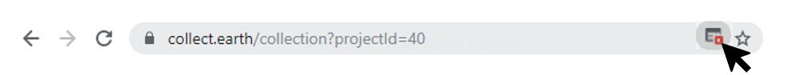
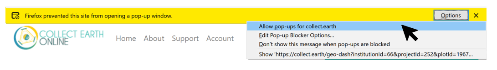
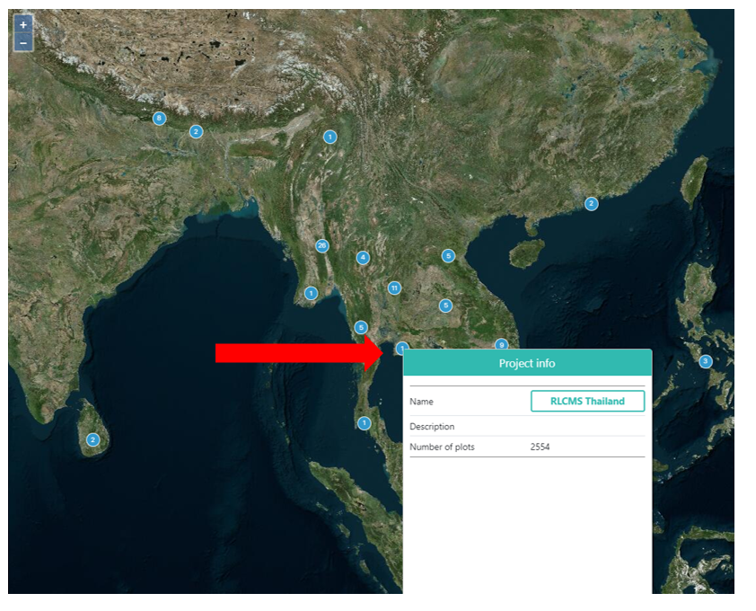
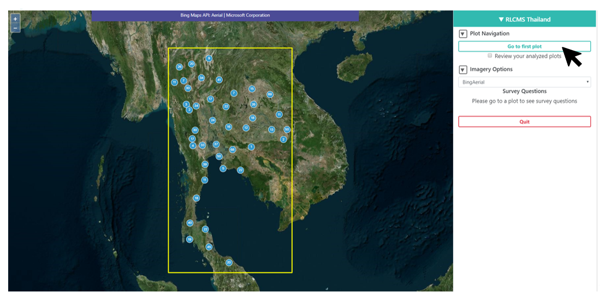
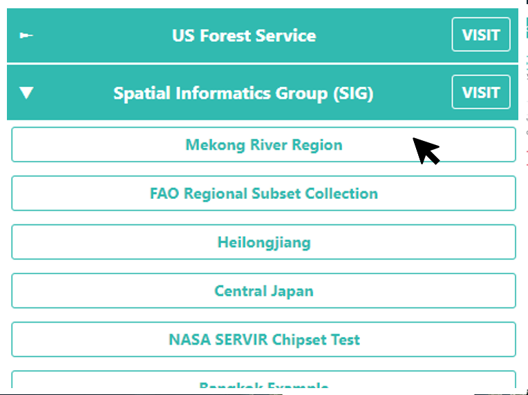

Preparing for Data Collection
=============================

Allow pop-ups
-------------

If it is your first-time collecting data with Collect Earth Online, or you have switched computers, you may need to allow pop-ups from the CEO site. CEO uses pop-up windows to display additional, relevant information about each plot through the Geo-Dash interface.

How to enable pop-ups varies based on the browser you are using. The most used browsers are discussed below. However, if your browser is not covered, simply search online for your browser name & “allow pop-ups” and the search engine should return relevant results.

**For Google Chrome:**

#. Check the address bar. If it is marked with a pop-up blocked icon (see image below), click on the **[popup blocked]** warning.
#. In the popup window that appears, select **Always allow pop-ups from https://collect.earth/.** Then click **[Done]**.
#. If there is no icon, follow the directions here: `Chrome Support <https://support.google.com/chrome/answer/95472>`__.

**For Mozilla Firefox:**

#. Check for a yellow bar below the address bar (see image below). If there, click on the **[Options]** button.
#. In the popup window that appears, select **Allow pop-ups for** collect.earth.
#. If there is no icon, follow the directions here: `Mozilla Support <https://support.mozilla.org/en-US/kb/pop-blocker-settings-exceptions-troubleshooting#w_pop-up-blocker-settings>`__.

Option 1: Work on a public project
----------------------------------

1. From the **Home** page, you can begin collecting data on public projects. There are map pins representing each project at the project location.
2. Select a project by first clicking on a **[map pin]**. Then from the pop-up **Project info** menu, click on the name of one of the projects in the pop-up window.

3. This will take you to the **project’s homepage**, a screen that shows a **Map** of the whole study region on the left & the **Data Collection Toolbar** on the right.
4. Under **Plot Navigation**, Click the green **[Go to first plot]** button to begin collecting information.

Option 2: Select a project from an institution
----------------------------------------------

1. If your institution has a specific project you want to work on, make sure you are logged in and then click on your institution’s name on the left-hand side of the **Home** page. You may want to use the **Enter text to filter** box to find your institution.
2. A drop-down list of the institution’s available projects will open. Select the project of interest by clicking on the project’s name.

3. This will take you to the project’s home screen as described above.
4. Click the **[Go to first plot]** button to begin collecting information.
5. You can also go to a project through the **Institution’s** page via the **info button**. There are three colors of projects on the **Institution** page. 

   - Blue-green highlighted project names have completed data collection.
   - Yellow project names are partly collected.
   - Red project names have no data collected.

