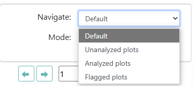
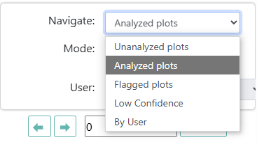
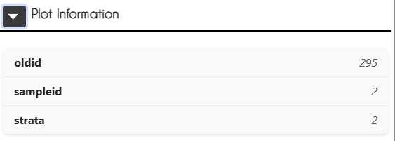
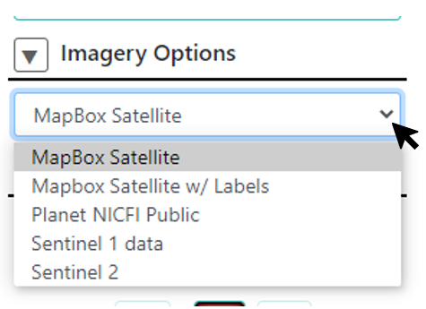
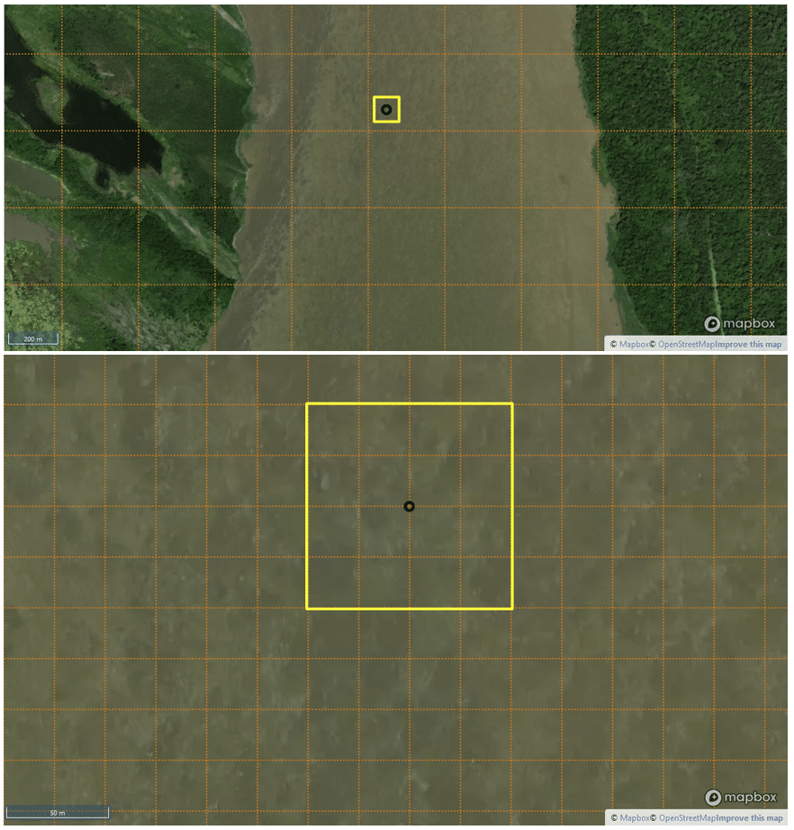
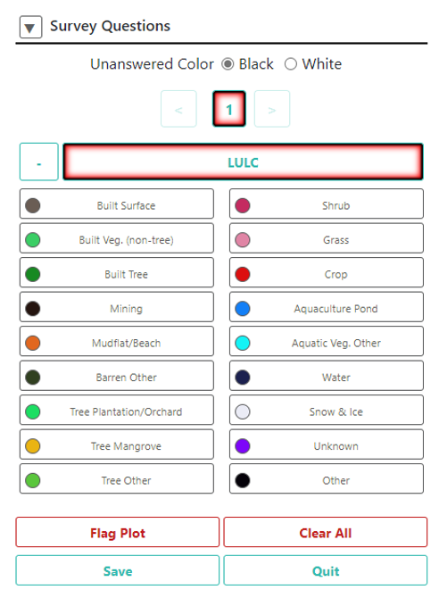
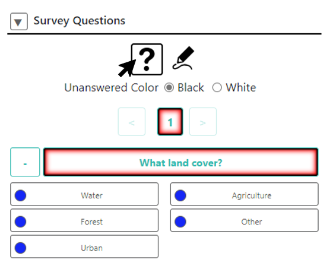
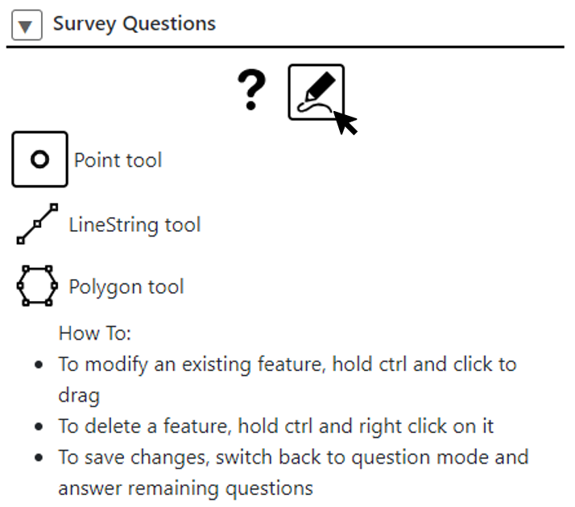

Standard Data Collection
========================

This section will guide you through the data collection interface and the data collection process for Standard projects.

Data collection for Standard projects follows four basic steps:

1. Read the project information, survey questions, and possible answers.
2. Draw and/or select the sample points.
3. Assign the sample points an answer for each question in the survey.
4. Save your answers.

The analysis screen
-------------------

First, go to a plot. You can click the **[Go to first plot]** button or select a plot from the map, depending on your project. CEO will load the plot and enable you to start collecting data.

Now we will familiarize ourselves with the analysis screen. 

.. tip::
   
   You can access help for the analysis screen at any time by clicking on the purple ? in the top right hand corner of the screen. The help function will point out important features of the data collection page.
   
   .. figure:: ../_images/preparing6.png
      :alt: The help for the analysis screen.
      :align: center

Map window
^^^^^^^^^^

On the left hand side is the map window:

1. Your **sample plot** will show up as a yellow circle or square in the map window. The sample shape is dependent on how the project has been designed.
2. Each **sample point** is identified with a black circle until it is assigned a label. 

.. tip::
   
   You can change the color of the sample points without answers from black to white by selecting the corresponding color radio button next to “Unanswered Color” on the right-hand panel.

3. You can zoom in and out using the blue + and – buttons in the upper left-hand corner of the map window, or by scrolling your mouse wheel.
4. Information about the imagery source is shown at the bottom left of the screen.

.. _options-and-survey-questions:

Options and Survey Questions
^^^^^^^^^^^^^^^^^^^^^^^^^^^^

On the right-hand side are all of the navigation, external tool options, imagery options, and survey questions.

**Navigation Options**

As an institution Member, the **Navigate:** dropdown menu allows you to choose between:

- **Default**: This will navigate through plots assigned to you and any available unanalyzed plots. In general, you will not need to switch the navigation mode from this option.
- **Unanalyzed Plots**: This option allows you to collect data on unanalyzed plots to contribute to your project.
- **Analyzed plots**: Review your previously analyzed plots. This option will allow you to correct mistakes etc. for previously analyzed plots.
- **Flagged plots**: Review plots you have flagged. 

As an institution Administrator, the **Navigate:** dropdown menu allows you to choose between:

- **Unanalyzed Plots**: Examine plots that have not been analyzed by any user.
- **Analyzed plots**: Examine plots analyzed by any user.
- **Flagged plots**: Examine plots flagged by any user. 
- **Low Confidence**: Examine plots with low plot confidence.
- **User:** Examine plots collected by any user. A dropdown menu allows you to choose which user.
- **QA/QC:** Examine plots where the collected answers have more than a specified level of disagreement. You can also click the **View Disagreements** button to examine user’s responses side by side in a separate window. See the Institution and Project Creation manual for more information.

Some of these options may not be available, depending on the settings of your project.

- Under this dropdown menu is the **Plot ID number**.
- The navigation menu contains blue **[forward]** and **[backward]** buttons to navigate to different plots, as well as a text box where you can enter a plot ID number and then click **[Go to plot]** to navigate to a specific plot.

**External Tools Options**

- Click **[Re-Zoom]** to return your focus to the focus plot
- **Click [GeoDash]** to open the **GeoDash** pane with additional information about the plot, if it is available for the project (For more detail see :doc:`geodash`).
- **[Hide Samples]**: This button will hide the sample points in the map window. This can be useful if you want to see the plot without the sample points obscuring the imagery.
- **[Hide Boundary]**: This button will hide the boundary of the plot in the map window.
- You can click **[Download Plot KML]** to download a KML file with the plot information. Downloading the KML allows you to transfer the plot information to another program, such as Google Earth Desktop. Importantly, the KML functionality allows users to determine the coordinates (latitude and longitude) at which points of interest are located.

 .. figure:: ../_images/preparing9-1.png
    :alt: External tools option.
    :width: 60%
    :align: center

- The **[Go to GEE Script]** button may or may not be present on your dashboard. If it is present, it will take you to an Earth Engine Apps website displaying additional data about the plot. You can learn more about this feature in the :doc:`/collection/advanced` section of the documentation.
- Click **[Interpretation Instructions]** to open a pop-up window with instructions on how to collect data for the project. These instructions are provided by the administrators leading the project. This information can be useful if you are unsure how to answer the survey questions.
- You can click **[Google Earth Web]** to open the plot in Google Earth's web interface. Similar to Google Earth Desktop, you can use Google Earth's historical imagery to view changes over time and gain additional context for your analysis. To turn on historical imagery in Google Earth Web, click on the Layers icon in the lower right and toggle the Historical Imagery option. Your administrator may also set up a Reference Project for you to use. This can also be accessed under the Layers menu.

**Plot Information**

If your administrator has set up the project to include plot information, you will see a **Plot Information** panel. This panel contains relevant information about the plot that your administrator has included. This section is collapsed by default, but you can click on the **[Plot Information]** arrow button to expand it.

**Imagery Options**

- Using the dropdown under **Imagery Options**, you can change the background image by selecting between different imagery on the drop-down list.

- Different images are helpful for comparing different points in time and/or where one imagery source does not have enough detail to answer the **Survey Questions**. Some imagery options also include the names of towns, villages, etc.
- You may need to click **[Update Imagery]** to update the imagery when you select a new imagery source.

.. note::
   
   Some imagery servers are slow. Please be patient when switching to sources like Planet Daily, since their servers can take about 30 seconds to respond to queries sent by the CEO platform.

- The **[Enable Map Grid]** button will add a grid to the map window that changes size depending on the level of zoom. This can be useful for orienting yourself in the map window and for determining the size of the sample plot. This grid function can help data collectors estimate things like percent land cover for plots and samples.

**Survey Questions**

- This is the area to answer the project’s **Survey Questions**.

- Each project has a different set of numbered survey questions (in the example only “1” question is in the project).
- You can navigate between questions using the forward and back arrows or the numbers.
- The **Unanswered Color** radio button changes the color of the survey points.
- Your project may have a **Plot Confidence** slider. There is also an optional comment box to describe your plot confidence.
- The **Save** button will save your survey answers and move on to the next point (it only becomes active when all points have been interpreted).
- **Flag Plot** is used when a survey question cannot be answered, either because the imagery is not of high enough quality or there is another problem; this will advance to the next plot. When you flag a plot, a text box will appear so that you can type in why you flagged the plot. For example, you might write “Cloud” if there is a cloud in the imagery over the plot.
- **Clear All** erases all your survey question answers for this plot.
- **Quit** will return you to CEO’s **Home** page. If you try to leave the page without saving your answers, you will receive a warning and reminder to save your answers if appropriate.

**Survey questions with user-drawn samples**

- Your project may have been set up to allow for user drawn samples.
- If so, you will see two icons under **Survey Questions**, a question mark and a pencil.
- When you have the question mark selected, the Survey Question interface will work as we just discussed.

- However, if you select the pencil icon, you will see the options that allow you to draw different points, lines, and polygons on the map.

- You can switch between the different shapes by clicking on their respective icons. Note that your project administrator may have restricted the types of geometries (point, line, polygon) that you can create.

Geo-Dash
^^^^^^^^

The **GeoDash** pop-up window will also open with information about the plot if it has been configured for the project. This window contains information to help identify land cover and land use attributes compiled from Google Earth Engine. Depending on the project, Geo-Dash can include plots of time series data (such as how NDVI values have varied over time), Landsat image chips, and more. See :doc:`/collection/geodash` for more information.

Analyze plots
-------------

Now it is time to contribute to a project. Make sure you have clicked on **Go to first plot** or selected a plot from the map.

1. Read the first Survey Question and the possible answers.
2. If you want to assign the same class or answer to ALL points in the plot (prior to having applied an answer to any of the points), you can just click on the answer without first needing to select the points.
3. If you want to assign different classes or answers to points in the plot, you will first select your sample points. When sample points are selected, they turn blue.

   - To select a *single* sample point, click on it with the left mouse key.
   - To select *several* sample points, click on them while keeping the Shift key pressed down.
   - To select *all* points in the sample or all points in a rectangle, hold down Ctrl, then click, hold, and drag in the map window to draw your rectangle.

4. When your sample points are marked in blue, you can assign them a sample value by clicking on the suitable value in the legend to the right of the map window. The sample points are then marked in the color of the value class. Here, these sample points are not forest (shrubland), so we select Other.

   .. figure:: ../_images/collect1.png
      :alt: Selecting an answer.
      :width: 100%
      :align: center

   - If it is hard to answer the question because the basemap imagery does not provide enough detail, try changing the imagery as described in :doc:`preparing`.
   - You may also want to change the basemap to check for seasonal effects (See :ref:`seasonality`).
   - Try zooming out to gather context clues from the landscape.
   - If you make a mistake and assign the wrong value to a point or points, you can reselect the points & change the assigned sample value.

5. If there is a second survey question, click on  **[2]** or the **[Right arrow]**. Read this question & the answers, reselect the points and assign them the correct secondary attributes.
6. Your project may have “rules,” which help ensure that all answers are logically consistent.

   - If your project has rules for a survey question, there will be a clipboard icon next to the question text.
   - You can hover over the clipboard icon to see the rules.

   .. figure:: ../_images/collect2.png
      :alt: Mouseover the clipboard icon to see the rules.
      :width: 80%
      :align: center

   - If you violate the rules, there will be a popup explaining what is wrong with your answer.

   .. figure:: ../_images/collect3.png
      :alt: A rule pop-up.
      :width: 80%
      :align: center

7. Your project may have a confidence slider. If this feature is enabled, simply choose the percentage value that best represents your confidence in your answers, where 100 is totally confident.
8. Continue until all sample points have been assigned a value for all survey questions.
9. Then, click on **[Save]**. You will receive an error message if you have not answered all of the questions.
10. The next plot for analysis shows up automatically.
11. When all plots are classified, a pop-up window appears to inform you that all sample plots of your project are analyzed.

User-drawn samples
------------------

For projects with user-drawn samples, you will need to first draw yoursamples before you can answer questions about them. Note that your project administrator may have limited the types of geometries (e.g. points, lines, or polygons) you can draw.

1. First, click on the **[pencil icon]**.
2. Now, select **[Point]**, **[Line]**, or **[Polygon]** tool as needed for the project.
3. To start drawing, simply click on the map.

   - For points, click once for each point you would like to add.
   - For lines, click once for each vertex you would like to draw. To complete the line, right click or double click.
   - For polygons, click once for each vertex you would like to draw. To complete the shape, click on your first vertex or double click.

4. To modify an existing feature, hold CTRL and click to drag.
5. To delete a feature, hold CTRL and right click on it.
6. To save your drawn shapes, switch back to the question mode.

   .. figure:: ../_images/collect4.png
      :alt: User drawn shapes example.
      :width: 100%
      :align: center

