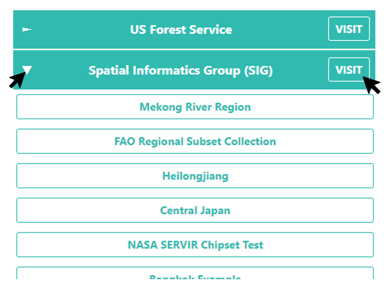

:html_theme.sidebar_secondary.remove:

Welcome to Collect Earth Online's documentation!
================================================

Collect Earth Online (CEO) is a free and open-source image viewing and interpretation tool, suitable for projects requiring information about land cover and/or land use. CEO enables simultaneous visual interpretations of satellite imagery, providing global coverage from MapBox and Bing Maps, a variety of satellite data sources from Google Earth Engine, and the ability to connect to your own Web Map Service (WMS) or Web Map Tile Service (WMTS). The full functionality is implemented online; no desktop installation is necessary.

.. youtube:: sRX-vwsgoCg
   :align: center
   :width: 100%

Getting started
---------------

Create your account and get started with CEO.

.. grid:: 1 3 3 3
   :gutter: 2

   .. grid-item-card:: :fas:`sign-in` Register for CEO
      :link: setup/register.html

      Set up your Collect Earth Online account.

   .. grid-item-card:: :fas:`plug` Join an institution
      :link: setup/joining.html

      Learn how to join an institution in CEO.

   .. grid-item-card:: :fas:`users` Set up an institution
      .. :link: institution/create.html

      Set up your own institution in CEO.

bla bla bla some text here

   Clicking on an institution's name.

.. Learn more about CEO
.. --------------------

.. CEO enables users to efficiently collect up-to-date information about their environment and observe changes over time. Learn more about getting CEO to work for you.

.. .. grid:: 1 3 3 3
..    :gutter: 2

..    .. grid-item-card:: :fas:`map` Start collecting data
..       :link: collection/index.html

..       Learn how to collect data in CEO.

..    .. grid-item-card:: :fas:`cogs` Manage an institution
..       :link: institution/index.html

..       Get your own institution up and running.

..    .. grid-item-card:: :fas:`globe` Create a project
..       :link: project/index.html

..       Create your own project and start collecting data.

.. Get more help or request a feature
.. ----------------------------------

.. Have questions? Encounter bugs? Get the help you need using the links below. 

.. Want to request a feature that would make CEO work better for you? 

.. .. grid:: 1 2 2 4
..    :gutter: 2

..    .. grid-item-card:: :fas:`book` Read the blog
..       :link: https://www.collect.earth/blog/

..       Our blog has details on updates and other useful information.

..    .. grid-item-card:: :fas:`question` Ask a question
..       :link: https://openforis.support/tags/collectearthonline/#gsc.tab=0

..       Ask a question on the OpenForis forum.

..    .. grid-item-card:: :fas:`bug` Improve this documentation
..       :link: https://github.com/openforis/collect-earth-online-doc

..       Submit a documentation improvement request through GitHub.

..    .. grid-item-card:: :fas:`envelope` E-mail us
..       :link: mailto:support@collect.earth

..       Other questions or bugs? Get in touch.

Supporting Institutions
-----------------------

Collect Earth Online is part of the `Open Foris <http://www.openforis.org>`__ suite of tools.

CEO was developed by SERVIR—a joint initiative of NASA and USAID, working in partnership with leading technical organizations around the world—and the Food and Agriculture Organization of the United Nations.

With the support of:

.. logos:: funders

In partnership with:

.. logos:: partners

.. toctree::
   :maxdepth: 2
   :hidden:

   Getting Started<setup/index>