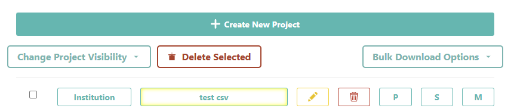
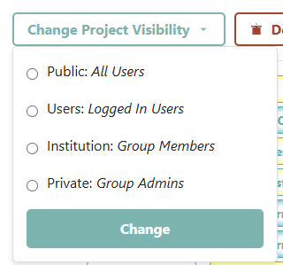
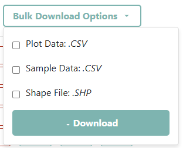
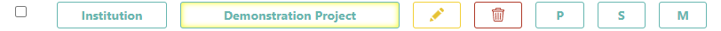
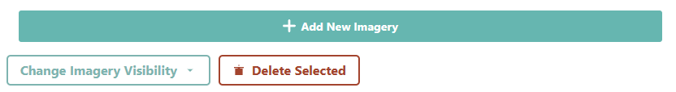

Institution management
======================

Institution information
-----------------------

If you are an Administrator for an Institution, you can make changes to your Institution's information after the Institution is created.

1. If you want to make changes, start by navigating to your Institution’s info page (See :doc:`create`).
2. You can make changes to the Institution page by clicking **[Edit]** at the top of the page.
3. You can also delete your Institution by clicking **[Delete]**. 
   
   .. warning::
    
     This action is **PERMANENT**, and your Institution cannot be recovered afterwards. **ALL PROJECTS ASSOCIATED WITH THE INSTITUTION WILL ALSO BE DELETED.**

Key Institution components
--------------------------

More importantly, you can also manage three aspects of your Institution that allow data collection through CEO. These include the **Imagery** available, the data collection **Projects**, and the **Users** associated with the Institution. This information is displayed in three panels on your **Institution’s** info page.

1. The **Projects** panel lists your Institution's projects, identifies projects as public or private, and allows you to create new projects. This is discussed in more detail in :doc:`../project/create`.
2. The **Imagery** tab lists all available imagery. You can add new imagery feeds here as well. For more detail, see :doc:`imagery`.
3. The **Users** panel lists your Institution's members and allows them to be updated. This is discussed below.

Project management
------------------

As an Administrator, you can manage the projects associated with your Institution in the **Projects** tab of your Institution page. You can create new projects, edit existing projects, and delete projects. You can also download plot, sample, and shapefile data for your Institution's projects.

You can create a new project by clicking the **[Create New Project]** button. This will take you to the **Create Project** page, where you can specify the project name, description, and other details. You can also select the imagery and WMS feeds that will be used in the project. For more detail on setting up a project, see :doc:`../project/create`.

Below this, you can see three options for managing your Institution's projects.  

1. **[Change Project Visibility]**: This allows you to change the visibility of your Institution's projects. There are four different levels of visibility: Public, Users, Institution, and Private. Public projects are visible to all users with or without a CEO account, Users projects are visible to any user logged in with a CEO account, Institution projects are only visible to members or administrators of the Institution, and Private projects are only visible to the Institutions Administrators.

2. **[Delete Selected]**: This allows you to delete selected projects from your Institution. You can select multiple projects by checking the boxes next to their names. Once you have selected the projects you want to delete, click the **[Delete Selected]** button. CEO will ask you to confirm your changes. Click **[OK]** to confirm. **PROJECT DELETION IS PERMANENT** and cannot be undone. All data collected in the project will also be deleted, including plots, samples, and answers.
3. **[Bulk Download Options]**: This allows you to download the data from multiple projects. You can download the data in three formats: Plot Data, Sample Data, and Shapefile. The Plot Data includes all the data collected for each project, the Sample Data includes all the data collected for each project, and the Shapefile includes the spatial data for each project. Click on the button for each of the format(s) you want to download, and CEO will generate a compressed file for you to download. For more information on downloading data, see :doc:`../project/management`.

In addition to these options, there are individual options for each project in the list:
1. **[Selection Checkbox]**: This allows you to select a project for bulk actions, such as deleting or downloading data.
2. **[Project Visibility Level]**: This indicates the visibility level of the project. The visibility levels are Public, Users, Institution, and Private. You can change the visibility level of a project using the bulk action menu above or in the Project's Management page.
3. **[Project Name]**: This is the name of the project. Clicking on the project name will take you to the project's data collection page, where you can collect data for the project.
4. **[Edit]**: This allows you to edit the project details, including the project name, description, and imagery. You can also change the visibility of the project from this page.
5. **[Delete]**: This allows you to delete the project from your Institution. Clicking this button will prompt you to confirm the deletion. **PROJECT DELETION IS PERMANENT** and cannot be undone. All data collected in the project will also be deleted, including plots, samples, and answers.
6. **[P]**: Download Plot Data for the project.
7. **[S]**: Download Sample Data for the project.
8. **[M]**: Preview the Learning Material for the project.

Imagery management
------------------

As an Administrator, you can manage the imagery available for your Institution in the **Imagery** tab of your Institution page. You can add new imagery feeds, edit existing imagery feeds, and delete imagery feeds.

At the top of the **Imagery** tab is the **[+ Add New Imagery]** button. This allows you to add a new imagery feed to your Institution. Clicking this button will take you to the **Add Imagery** interface, where you can specify the imagery feed details. For more information on adding imagery, see :doc:`imagery`.

At the top of the page are bulk actions for managing imagery feeds:
1. **[Change Imagery Visibility]**: This allows you to change the visibility of your Institutions imagery feeds. There are two levels of visibility: Public and Institution. Institution imagery feeds are only available to the Institution that created them. This is the default.Public imagery feeds are available to all Institutions in CEO. **USE THIS AT YOUR OWN RISK** You can change the visibility of an imagery feed by selecting it from the list and clicking the **[Change Visibility]** button. CEO will ask you to confirm your changes. Click **[OK]** to confirm. 
2. **[Delete Selected]**: This allows you to delete selected imagery feeds from your Institution. You can select multiple imagery feeds by checking the boxes next to their names. Once you have selected the imagery feeds you want to delete, click the **[Delete Selected]** button. CEO will ask you to confirm your changes. Click **[OK]** to confirm. **IMAGERY DELETION IS PERMANENT** and cannot be undone.

Next to each imagery feed in the list are individual options for managing that feed:
1. **[Selection Checkbox]**: This allows you to select an imagery feed for bulk actions, such as changing visibility or deleting.
2. **[Imagery Name]**: This is the name of the imagery feed.
3. **[Edit]**: This allows you to edit the imagery feed details.
4. **[Delete]**: This allows you to delete the imagery feed from your Institution. Clicking this button will prompt you to confirm the deletion. **IMAGERY DELETION IS PERMANENT** and cannot be undone.

Institution user (member) management
------------------------------------

As an Administrator, you can add a Collect Earth Online member to the Institution by typing the user's email address into the box and clicking the **[Add User]** button. If you are successful, a pop-up window will notify you that the user has been given the role "Member," and the user's email address will appear in the list of users.

   .. tip::
   
      Only email addresses that have already created a CEO account can be added to the Institution.
   
There are two roles for users in an Institution: **Admin** and **Member**. The Administrator role allows the user to edit any of the Institution's projects, add and delete imagery, and manage the Institution's Users. The Member role allows the user to collect data in the Institution's projects.

As an Administrator, you can change the role of any user using the drop-down menu and buttons to the right of their email address.

1. Click on the drop-down menu to the right of their email address. 
2. Select **Admin** or **Member**.
3. Click the **[Update]** button to save your changes. CEO will ask you to confirm your changes. Click **[OK]** to confirm.
4. You can also remove users from the Institution by clicking on the **[Remove]** button. If you do this, the user will no longer be able to access any of the Institution's projects.  

You can approve or reject pending affiliation requests as well.

1. If a user has requested to join your Institution, you will see their email address in the list of users with a status of "**Pending**." 
2. You can approve this request by clicking the drop-down menu next to their email address and selecting **Admin** or **Member** buttons next to their email address. If you select **Admin**, the user will be given Administrator privileges for the Institution. If you select **Member**, the user will be given member privileges.
3. You can deny this request by clicking the **[Remove]** button. This will remove the user from the list of pending requests. 

   .. note::
   
      If you are an Administrator for an Institution, you can also remove other Administrators from the Institution. However, you cannot remove yourself from the Institution. If you want to remove yourself from the Institution, you will need to ask another Administrator to do this for you.

   .. note::
      
      To restrict the Administrator capabilities of a user to only one of the Institution's projects, you can create a new Institution specifically for that project. Add the user as an Administrator for the new Institution.

Other Administrator privileges
------------------------------

1. As an Administrator, you can review and modify the answers for all plots, including plots labeled by other CEO users. Members of an Institution can only review and modify answers for plots they themselves have labeled. To access this feature, use **Review** toggle for the **Navigate Through** dropdown menu on the **Collection Page**. See :doc:`../project/reviewdata` for more information.
2. As an Administrator you can review Draft Mode projects that you or other Administrators have created. This is discussed further in :doc:`../project/create`.
3. As an Administrator, you can download collected data from Institution projects. See :doc:`../project/reviewproject`.
