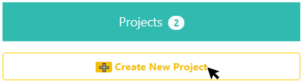
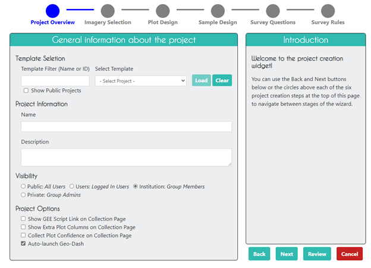
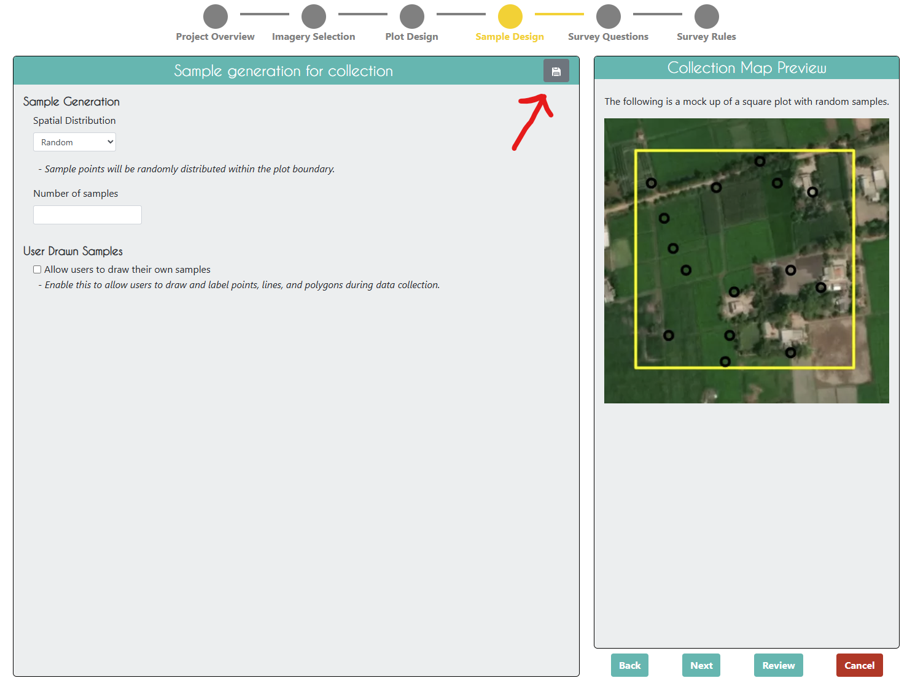

Project Creation
================

After you have created an Institution or joined an Institution with Admin privileges and loaded any desired imagery into your Institution, you are ready to create a new project.

Setting project goals
---------------------

Before starting a data collection effort in CEO, make sure you have concrete goals, indicators, and metrics for your initiative. While this manual focuses on technical issues, other resources are available to help you create these goals, indicators, and metrics. Some helpful resources include:

- The *Road to Restoration: A Guide to Identifying Priorities and Indicators for Monitoring Forest and Landscape Restoration*, found at: http://www.fao.org/in-action/forest-landscape-restoration-mechanism/resources/detail/en/c/1253837/. This guide from FAO & WRI outlines steps toward setting goals, choosing indicators, and defining metrics.

If your project is focused on land use or land cover classification, you also need to have a classification scheme and an interpretation key. A classification scheme should be exhaustive, exclusive, consistent with the purpose of the work, and sufficiently descriptive. The scheme can be either single level or hierarchical and it does not need to be of uniform detail. Data collectors refer to an interpretation key—a collection of rules, imagery, and guidance—to classify land cover elements. A comprehensive interpretation key allows data collectors to produce more consistent and reliable results.

-  Chapters 2 & 3 of the Theoretical Manual from Collect Earth Online, found at https://collect.earth/downloads/CEO_Theoretical_Manual.pdf.

Designing a project is an iterative process, and you will probably need to make multiple edits to projects in CEO as you refine your goals, land use or land cover classification schemes, imagery sources, etc. These changes can be made to a project before your project is published. This means that you can create a project and collect test data in it, and edit any errors you find before publishing the project.

Some things can also be changed after a project is published, including imagery. For example, if you realize after you have created a project that you have forgotten to add an imagery layer, you can add it after project setup.

The survey questions that are asked about each survey point cannot currently be changed after the project is published. Do not start data collection until you are sure that your survey questions are correct.

The instructions below assume you are starting on your **Institution** page and are logged in as an Administrator for your Institution.

The Create Project Wizard
-------------------------

In the **Projects** tab on your Institution page, click **[Create New Project]**. This will bring you to the Create Project wizard.

The wizard comprises 6 parts: Project Overview, Imagery Selection, Plot Design, Sample Design, Survey, and Rules.

Each of these parts is described in detail below. You can navigate between the different parts of the wizard using the tabs at the top of the page or the **[Next]** and **[Back]** buttons at the bottom of the page. You can also click **[Save Draft]** to save your progress and return to the wizard later. The **[Cancel]** button will take you back to your Institution page without saving any changes you have made in the wizard.

Finally, on the **Plot Design**, **Sample Design**, and **Survey Questions** tabs, you can click on the grey **[Save]** button to save your project as a draft. This will allow you to return to the project later and continue editing it. CEO will save your draft project for 7 days. If you do not return to the project within 7 days, it will be deleted. 

