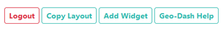
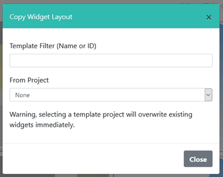
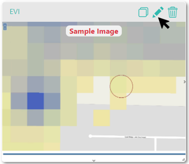
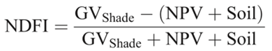
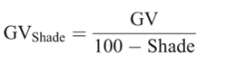

Geo-Dash Implementation
=======================

The **Geo-Dash** is a dashboard that opens in a second window when users begin to analyze sample plots. Geo-Dash provides users with additional information to help them interpret the imagery and better classify sample points and plots. The Geo-Dash tab can be customized to show information such as an NDVI time series, additional imagery, and a forest degradation widget.

You can configure your **Geo-Dash** by clicking on **[Configure Geo-Dash]** from the **Project Information/ Review Project** page.

This will bring up the **Geo-Dash layout screen**, with four options in the upper right corner of the screen.

Clicking on **[Copy Layout]** will allow you to copy the Geo-Dash from another project. 

.. warning::
   This will delete any existing Geo-Dash you have associated with the project!

You can add individual Geo-Dash widgets by clicking **[Add Widget].** To find out what each of the widgets do, click on **[Geo-Dash Help]** to open the **Geo-Dash Help Center**. We will also discuss this functionality below.

CEO uses Google Earth Engine to process many of the Geo-Dash widgets. Therefore, the information about Image Visualization for GEE is also useful here, specifically the min and max descriptions: https://developers.google.com/earth-engine/image_visualization.

Common Indices and Data Sources
-------------------------------

Some of the widgets provide access to common indices and data sources. These include NDVI, EVI, EVI2, NDMI, and NDWI, along with Landsat and Sentinel imagery. NDVI, EVI, EVI 2, NDMI, and NDWI indices are available in both image overlays and time series graphs.

The normalized difference vegetation index (NDVI) is used to determine if the cell contains live green vegetation. In map based representations, dead plants and inanimate objects are represented as red, while live healthy plants are represented as green. In numerical representations (e.g. time series graphs), values below 0 represent dead plants or inanimate objects, 0-0.33 represents unhealthy plants, 0.33-0.66 represents moderately healthy plants, and 0.66-1 represents very healthy plants. For more information, see e.g. https://www.usgs.gov/land-resources/nli/landsat/landsat-normalized-difference-vegetation-index

The enhanced vegetation index (EVI) and two-band EVI (EVI 2) are optimized vegetation indexs. They are designed to have higher sensitivity in high biomass regions e.g. along the equator, correct for canopy background signals, and reduce atmospheric influence on index values. In doing so, these indices addresses some of the key limitations of NDVI, however EVI requires more data to calculate and therefore has its own limitations. EVI 2 is in development and can be calculated just from red and near infrared bands. As with NDVI, red is used to represent dead plants/inanimate objects and green to represent healthy plants. The index varies between 0-1, with 0 representing dead plants and 1 representing very healthy plants. For more information on EVI see e.g. https://www.usgs.gov/land-resources/nli/landsat/landsat-enhanced-vegetation-index.

The normalized difference moisture index (NDMI) is used to determine the water content of vegetation. NDMI can be used for drought monitoring and for determining fuel loads (combustibility) for wildfire hazard assessments. Values near -1 indicate plants with low moisture while values near 1 indicate plants with high moisture. More information on NDMI can be found at e.g. https://www.usgs.gov/land-resources/nli/landsat/normalized-difference-moisture-index.

The normalized difference water index (NDWI) is also related to plant water content and plant water stress. It can be used to map water bodies, determine crop health and for wildfire risk analysis. Values near -1 indicate low water content and vegetation cover and values near 1 indicate high water content and vegetation cover. More information on NDWI can be found at e.g. https://edo.jrc.ec.europa.eu/documents/factsheets/factsheet_ndwi.pdf.

Data from Landsat satellites 5, 7, 8 and Sentinel 2 are also available. For more information about these datasets, see: Landsat: https://www.usgs.gov/land-resources/nli/landsat and Sentinel 2: https://sentinel.esa.int/web/sentinel/missions/sentinel-2. When more than one image is available for the date range selected for Landsat, the simpleComposite function in GEE is used to create simple cloud-free composite. It uses the median of the least cloudy pixels. Sentinel 2 data is also reduced using the median of least cloudy pixels.

Widget Formatting Hints
-----------------------

- Titles cannot contain special characters.
- Image parameters use JSON. Quotes used for image parameters in widgets should be vertical, not curly quotes. There should be no spaces in the image parameters.
- Lists can be formatted either as :code:`"1,2,3"` or as :code:`[1,2,3]` for numbers and :code:`"B3,B2,B1"` or :code:`["B3","B2","B1"]` for bands.
- When displaying three bands (e.g. B3, B2, B1 in RGB), Google Earth Engine and therefore the Geo-Dash can use either one or three values for min and max.
- For the Date Ranges, if the end date is longer than the period of record, only the available data will be displayed.

Move & Resize Widgets
---------------------

1. Widgets can be manipulated on the Geo-Dash Widget Layout Editor in the following ways:

   - Drag and drop to change widget position.
   - Resize by dragging from the bottom right corner.
   - Widgets will autotomatically align to a grid.

2. In the Geo-Dash collection page view, widget positions are are updated in real time.

.. figure:: ../_images/geodash2-1.*
    :alt: Move and resize widgets in the Geo-Dash
    :align: center

Duplicate, Edit, and Delete Widgets
-----------------------------------

1. You can copy a widget once it has been created by clicking on the **[duplicate icon]** in the upper right hand corner of the widget.
2. You can edit widgets once they are created by clicking on the **[pencil icon]** in the upper right hand corner of the widget.
3. To delete a widget, click on the trashcan in the upper right-hand corner of the widget.

(Forest) Degradation Tool
-------------------------

The Degradation Tool provides time-series information on forest degradation from selective logging, fire, and other large and small disturbances. The Normalized Difference Fraction Index (NDFI) allows for enhanced detection of forest canopy damage from multiple sources, including selective logging and forest fires.

It is calculated with this equation:

where

More detail can be found in: 

- Souza, C. M., Roberts, D. A., & Cochrane, M. A. (2005). Combining spectral and spatial information to map canopy damage from selective logging and forest fires. *Remote Sensing of Environment*, 98(2), 329-343.

To create and use the Degradation Tool in your Geo-Dash:

1. Click **[Add Widget]** in the upper right hand of the Geo-Dash layout screen.
2. Select **Degradation Tool** in the Type drop down.
3. Give the widget a **Title**.
4. Choose the **Basemap** source from dropdown. This will be the basemap for the widget and other data will be layered on top.
5. Choose which **Band to graph**. Available options include SWIR1, NIR, Red, Green, Blue, SWIR2, NDVI, NBR, NDWI and NDFI. NDFI allows for enhanced detection of forest canopy damage from multiple sources, including selective logging and forest fires.
6. Select the **Date Range** you would like. This tool can draw from Landsat 4 (July 1982-December 1993), Landsat 5 (March 1984-January 2013), Landsat 7 (April 1999-current), Landsat 8 (February 2013-current), and Landsat 9 (September 27 - current) based on the date range you select. Sentinel information is only available from April 2014 onward (Sentinel 1A launch).
7. Click **[Create]**.
8. Reposition and resize to your liking. This tool will have two panels stacked one on top of the other, so be sure to give it ample vertical space.

Add a Dual Imagery Widget
-------------------------

The dual imagery widget combines two different image collection widgets so the user can compare the images side by side.

To create a Dual Imagery Widget:

1. Click **[Add Widget]** in the upper right hand of the Geo-Dash layout screen.
2. Select **Dual Imagery** in the Widget Type drop down.
3. Give the widget a **Title**. We suggest an informative Title such as {Data} {Date range} e.g. NDVI 2001 or NDVI 2001-2002.
4. Choose **Basemap** source from dropdown. This will be the basemap for the widget and other data will be layered on top.
5. You will now select the **Imagery type** for the Bottom and Top images. You can toggle between them by clicking the **[Next Image]** and **[Previous Image]** buttons.

   - Select the **Imagery Type** for each image. Options include Image Asset, Image Collection Asset, and Preloaded Imagery Collection.
   - For more information about Image Assets, see :ref:`add-image-asset-widget`.
   - For more information about Image Collection Assets, see :ref:`add-image-collection-asset-widget`.
   - For more information about Preloaded Imagery Collections, see :ref:`add-preloaded-image-collection-widget`.
   - For information on the min, max, and cloud score see :ref:`add-image-asset-widget`. Min and Max are the values for the bands, while cloud score is a max percent of clouds in the image.

6. Select the **Date** range you would like, if applicable. If the end date is longer than the period of record, only the available data will be displayed.
7. Click **[Create]**.
8. Reposition and resize to your liking.

Institutional Imagery
---------------------

This widget allows you to simply show one of your institutional imageries. With this you can select any of your existing institutional imagery sources to display, using the setting you have already configured. To add an Institutional Imagery widget:

1. Click **[Add Widget]** in the upper right hand of the Geo-Dash layout screen.
2. Select **Institution Imagery** in the Type drop down.
3. Give the widget a **Title**.
4. Select a **Basemap**. You can choose any of your institutional imagery from the dropdown menu.
5. Click **[Create]**.
6. Reposition and resize to your liking.

.. _add-image-asset-widget:

Add an Image Asset Widget
-------------------------

Both the Image Asset Widget and the Image Collection Asset Widget allow users to connect to GEE data. This includes publicly available data through GEE as well as image assets from their own user accounts. There is a video tutorial for creating GEE image assets available online here: https://youtu.be/l57IhmduVBQ. Some example GEE scripts to create Image Asset in GEE:

- NDVI: https://github.com/SERVIR/gee-scripts/blob/master/GEE_NDVI_Clip_to_plot_Collection.js#L6
- Landsat8: https://code.earthengine.google.com/109485ad0712818dba270b767efbc540

1.  Click **[Add Widget]** in the upper right hand of the Geo-Dash layout screen.
2.  Select **Image Asset** in the **Widget Type** drop down.
3.  Give the widget a **Title**.
4.  Choose the desired **Basemap** source from dropdown. This will be the basemap for the widget and other data will be layered on top.
5.  Enter the **GEE Image Asset ID**. For example, :code:`COPERNICUS/S2/20170420T184921_20170420T190203_T10SEG`. This can be any image asset in Earth Engine, including assets from your own account. If you are using an asset from your own account, it must be shared publicly. If you need  your asset to remain private for data security reasons, message the team at support@collect.earth and we can help.
6.  You can view the **Available Bands** for your image by clicking on the **[Refresh]** button.
7.  Enter **Image Parameters** for the asset in JSON format. These follow the image visualization function in GEE (more info: https://developers.google.com/earth-engine/guides/image_visualization?hl=en):

.. code::

   {"bands":"CO_column_number_density,H2O_column_number_density,cloud_height","min":"0","max":"0.5"}

   {"bands":"NDVI","max":"1","min":"-1","palette":"c9c0bf,435ebf,eee8aa,006400"}

.. note:: 
   
   Note that there are no spaces, and all color values must be hex. The quotes around the numbers are optional, e.g. "max":0.5 will also work. As in GEE, you may also use brackets around the palette values, however if you use brackets each individual number must be quoted. 

8. Click **[Create]**.
9. Reposition and resize to your liking.

.. note::
   More on SRTM Digital Elevation Data. Previously in CEO you could add digital elevation data directly. This is now handled with the image asset widget. The SRTM Digital Elevation Data 30m widget pulls data from the Earth Engine Data Catalog. More information on this dataset can be found here: https://developers.google.com/earth-engine/datasets/catalog/USGS_SRTMGL1_003. The SRTM is an image asset USGS/SRTMGL1_003.

.. _add-image-collection-asset-widget:

Add an Image Collection Asset Widget
------------------------------------

An Image Collection is a stack or time series of images. There is a video tutorial for creating GEE Image Collection assets available online here: https://youtu.be/7eIvltgDbXw.

1. Click **[Add Widget]** in the upper right hand of the Geo-Dash layout screen.
2. Select **Image Collection Asset** in the **Widget Type** drop down.
3. Give the widget a **Title**.
4. Choose **Basemap** source from dropdown. This will be the basemap for the widget and other data will be layered on top.
5. Enter the **Google Earth Engine Image Collection Asset ID**, for example :code:`LANDSAT/LC8_L1T_TOA`. This can be any image collection in Earth Engine, including assets from your own account. If you are using an asset from your own account, it must be shared publicly.
6. You can view the **Available Bands** for your image by clicking on the **[Refresh]** button.
7. Select a **Collection Reducer**. Reducers are methods for collapsing multiple images in the image collection into a single image for the Geo-Dash to display. You can learn more about reducers here https://developers.google.com/earth-engine/guides/reducers_intro.
8. Enter **Image Parameters** for the asset in JSON format. These follow the image visualization function in GEE (more info: https://developers.google.com/earth-engine/guides/image_visualization?hl=en):

   - For example: :code:`{"bands":"B4,B5,B3","min":"10,0,10","max":"120,90,70"}`.
   - Do not use any spaces.

9.  Select the **Date Range**.
10. Click **[Create].**
11. Reposition and resize to your liking.

More on Landsat
^^^^^^^^^^^^^^^

Landsat is one of the Image Assets you can add. For better performance when using a GEE collection, we recommend that
you preprocess and clip the data to your AOI in GEE before connecting it to Geo-Dash. You can find a video tutorial on this process in the Geo-Dash Help Center under "Video Tutorial to Create GEE Image Assets."

The most common strings for Landsat are listed below. More detailed information can be found on the Google Earth Engine help pages; available composites and the covered time frame are found here: https://explorer.earthengine.google.com/#search/tag%3A32day.

For short change intervals, test the 8 day NDVI composite images; for longer change intervals, explore the 32 day composites.

You might notice in the 8 day composites unexpectedly low NDVI values for the season. This can be caused by cloud cover. If your sample sites are in an area with persistent cloud cover, choose the 32 day composite.

+-----------+--------------+------------+-----------------------------+
| Satellite | Type         | Start date | Image collection ID         |
+===========+==============+============+=============================+
| Landsat 8 | NDVI, 32 day | 2013-04-07 | LANDSAT/LC8_L1T_32DAY_NDVI  |
| Landsat 8 | NDVI, 8 day  | 2013-04-07 | LANDSAT/LC8_L1T_8DAY_NDVI   |
| Landsat 7 | NDVI, 32 day | 1999-01-01 | LANDSAT/LE7_L1T_32DAY_NDVI  |
| Landsat 7 | NDVI, 8 day  | 1999-01-01 | LANDSAT/LE7_L1T_8DAY_NDVI   |
| Landsat 8 | NDWI, 32 day | 2013-04-07 | LANDSAT/LC8_L1T_32DAY_NDWI  |
| Landsat 8 | NDWI, 8 day  | 2013-04-07 | LANDSAT/LC8_L1T_8DAY_NDWI   |
| Landsat 7 | NDWI, 32 day | 1999-01-01 | LANDSAT/LE7_L1T_32DAY_NDWI  |
| Landsat 7 | NDWI, 8 day  | 1999-01-01 | LANDSAT/LE7_L1T_8DAY_NDWI   |
+-----------+--------------+------------+-----------------------------+

The image collection ID for Sentinel-2 is COPERNICUS/S2 (2015-06-23 to present) and for Sentinel-1 is COPERNICUS/S1_GRD (2015-10-03 to present).

Add a Polygon Compare Widget
----------------------------

The polygon compare widget allows you to display polygons in Geo-Dash, so that e.g. you can compare them with your plot outlines. This uses a featureCollection in Google Earth Engine as input. You can use any feature collection, if it has a field that matches the PLOTID for your CEO project. The polygon is extracted from the featureCollection and turned into an image to display as WMS tiles in the widget.

We suggest you use the shapefile (.shp) option when creating your CEO project.

.. note::
   
   IMPORTANT: Your featureCollection needs to be shared as public so that CEO can access it. If you need to leave the collection private, message the team at support@collect.earth and we can help.

1. Click **[Add Widget]** in the upper right hand of the Geo-Dash layout screen.
2. Select **Polygon Compare** in the **Widget Type** drop down.
3. Give the widget a **Title**.
4. Choose **Basemap** source from dropdown. This will be the basemap for the widget and other data will be layered on top.
5. Enter the **Google Earth Engine Feature Collection Asset ID**. This can be any feature collection in Earth Engine, including assets from your own account. If you are using an asset from your own account, it must be shared publicly.
6. Enter the **field** that matches the PLOTID for the project. In the compare featureCollection widget, you will need to match PLOTIDs. The PLOTID column for your featureCollection can be named anything, just type in the proper column name into the Field to match PLOTID box.
7. Enter **Image Parameters** in JSON format to change the color of the polygon displayed. This uses the GEE feature and feature collection visualization function.
8. Click **[Create].**

.. _add-preloaded-image-collection-widget:

Add a Preloaded Image Collection Widget
---------------------------------------

Preloaded Image Collection widgets are commonly used widgets that the Collect Earth Online team has set up in advance for your ease of use.

1. Click **[Add Widget]** in the upper right hand of the Geo-Dash layout screen.
2. Select **Preloaded Image Collections** in the **Widget Type** dropdown menu.
3. Give the widget a **Title**.
4. Choose your **Basemap** source from the dropdown menu. This will become the basemap over which the other data is overlaid.
5. Select the **Imagery Source**. You can choose from Landsat, Sentinel-2, and Planet NICFI.
6. Select the **Imagery Source Type**. You can choose from Index or Composite.
7. Select **Date Range**. If the end date is longer than the period of record, only the available data will be displayed.
8. If you have select Index, you can now choose a **Band to graph**. 

   - **NDVI, EVI, EVI 2, NDMI**, and **NDWI** are preconfigured with the correct bands and image parameters. The index displayed will be the mean for the selected date range.

9. If you have selected **Composite** you can now choose the bands, min, max, and cloud score, depending on which options are available for the **Imagery Source** you selected. Available bands for each are:

   - Landsat: BLUE, GREEN, RED, NIR, SWIR1, TEMP, SWIR2
   - Sentinel 2: B1, B2, B3, B4, B5, B6, B7, B8, B8a, B9, B10, B11, B12, QA10, QA20, QA60
   - NICFI: R, G, B, N
   
   Min, Max, and Cloud Score will be determined by the user's needs. Min and Max are the values for the bands, while cloud score is a max percent of clouds in the image. Min and max can have one or three values.
         
   Example values include:
         
   - Sentinel-2:
     - bands: B8,B4,B3,
     - min: 450,
     - max: 3000,
     - Cloud Score: 10

10. Click **[Create].**
11. Reposition and resize to your liking.

Add a Statistics Widget
-----------------------

Statistics provide additional information, including population, area, and elevation about the current plot area that is being analyzed. The population data is from the CiESIB Gridded Population of the World v4 dataset and the elevation data is from the USGS EROS Global 30-Arc Second DEM.

1. Click **[Add Widget]** in the upper right hand of the Geo-Dash layout screen.
2. Select **Statistics** in the **Widget Type** drop down.
3. Give the widget a **Title**.
4. Click **[Create]**.
5. Reposition and resize to your liking.

Add a Time Series Graph Widget
------------------------------

Time Series Graphs, particularly for the vegetation indices, can help users differentiate between different types of vegetation based on seasonal patterns.

1. Click **[Add Widget]** in the upper right hand of the Geo-Dash layout screen.
2. Select **Time Series Graph** in the **Widget Type** drop down.
3. Give the widget a **Title**.
4. Select the **Imagery Source**. This will determine what **Band to graph** options you have.

   - **Landsat** allows you to graph **NDVI, EVI, EVI 2, NDMI**, and **NDWI**. These are preconfigured with the correct Landsat band calculations and image parameters. 
   - **NICFI** allows you to graph **NDVI, B, R, G**, and **N**. These are preconfigured with the correct band calculations.
   - **Custom** allows you to create a time series graph using any GEE image collection. An image collection from Google Earth Engine can be added here. You simply need to know the **GEE Image Collection Asset ID**, the **Band to graph**, the **Reducer** you would like to use, and the **Spatial scale**. For example:

     - GEE Image Collection Asset ID- COPERNICUS/S5P/OFFL/L3_CO.
     - Band to graph - CO_column_number_density.
     - Select the Reducer in the dropdown.
     - Spatial Scale: 30

5. Select a **Date Range**. If the end date is longer than the period of record, only the available data will be displayed.
6. Click **[Create].**
7. Reposition and resize to your liking.
