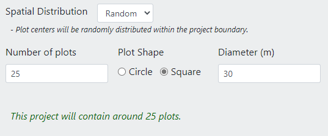
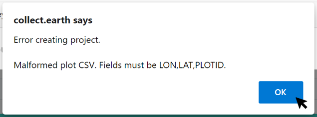
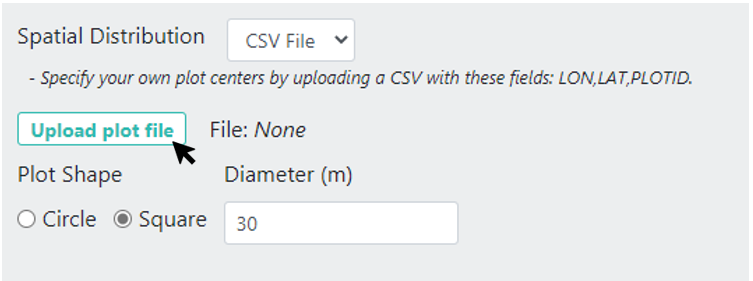
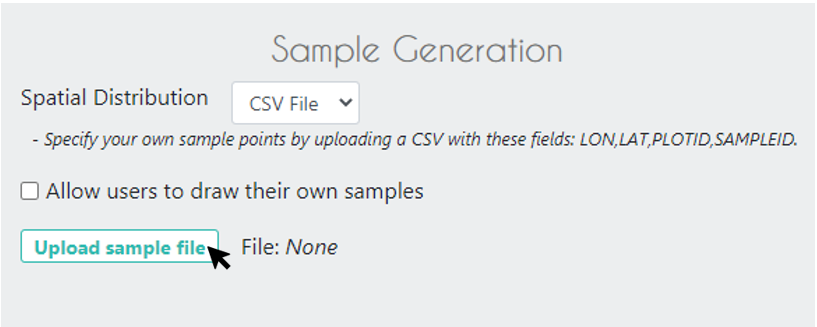
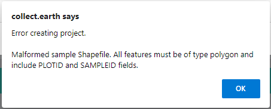
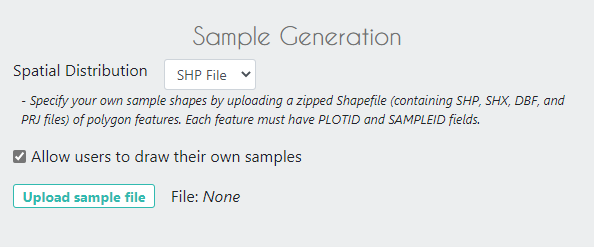

Plot Design
===========

Plot Design Background
----------------------

A well-prepared plot and sample design can provide a robust estimate of the parameters of interest for the population (percent forest cover, for example). This is often the most important factor in producing a reliable inventory or accuracy assessment. The goal of a sample is to provide an unbiased estimate of some population measure (e.g. proportion of area), with the smallest variance possible, given constraints including resource availability.

The first step of the built in CEO sample design is the plot design. The second step is selecting samples within a plot. Using these two steps, many sampling designs are possible with CEO.

For example, suppose you are quantifying forest cover on a landscape. For this approach, sample points are used to classify land cover and are then summarized at the plot level to create an estimate of the plot’s forest cover percent. Information about plots can then be used to estimate the forest cover at the landscape level and detect patterns or trends. The accuracy of your landscape level estimates will depend on how many plots you classify & how variable the landscape is, among other factors. More detailed theoretical information is available in CEO’s Project Development Manual (found at https://collect.earth/downloads/CEO_Theoretical_Manual.pdf).

Also, some terminology might help for the types of sampling available in CEO. **Simple random sampling** means that all points have an equal probability of being selected. It produces unbiased parameters. However geographic balance with small sample sizes can be difficult. Also, rare classes may not receive sufficient coverage. If you have rare classes you want to detect, we highly recommend using a **stratified random sampling** approach. Stratified random sampling is another type of probability sampling where the population is divided into different strata based on shared characteristics. For example, strata might be different land classes or geographic areas. 

Another type of sampling is **systematic gridded sampling**. This is a grid of points placed over the landscape at regular intervals and is not probability sampling. This provides excellent geographic balance, but it is not possible to calculate unbiased estimates of population metric variance.

There are two main approaches for specifying an area of interest (AOI) and sampling design: 1. using CEO’s built-in system and 2. Creating a sample in another program (QGIS, ArcGIS, etc.) and importing it into CEO. We will first discuss the built-in sampling design, and then discuss uploading your own sample as a .csv or .shp file. 

Plot Design: CEO’s built in system
----------------------------------

CEO’s built in system enables users to create sampling designs using an easy-to-use interface. There are two key parts, creating the AOI and Plot Generation. You only need to create an AOI if you are using CEO's built in system.

**Select your AOI.** 

There are three approaches.

1. The easiest way to select your project AOI is by drawing a box in the map window in the right hand pane (Collection Map Preview).

   1. Locate your area of interest by zooming in/out using the scroll wheel of your mouse, or the + and – boxes in the map window. You can pan the map by clicking on it and dragging the map window.
   2. Hold the CRTL-key (command key on a Mac) down and draw a box while keeping the left mouse key pressed down.
   3. Hold the SHIFT-key down and draw a box to zoom in.
   4. The coordinate boxes will populate once the box is drawn and you let your mouse key go. Coordinates are displayed in lat/long using **WGS84 EPSG:4326**.

   .. figure:: ../_images/project10.png
         :alt: Draw an AOI box
         :align: center
         :width: 70%

2. You can also manually enter your Boundary Coordinates into the boxes provided.

   .. figure:: ../_images/project11.png
         :alt: Manually add coordinates
         :align: center
         :width: 50%

3. The third approach is to upload a project boundary shapefile. To use this option, under **Boundary type** select Upload shp file. Then click on the **[Upload project boundary]** button. Navigate to your file, and click **[Open]**. Your shapefile should be a zipped folder containing requisite shapefile component pieces (SHP, SHX, DBF, and PRJ files). Once you click open, you should see the **File:** text populate with your file name and your project boundary appear in the Collection Map Preview pane. 

   .. figure:: ../_images/project12_v2.png
         :alt: Upload an AOI
         :align: center
         :width: 100%

.. note::
   
   If you have multi-part polygons each one will be assigned the number of plots indicated. This is indicated in the green text.

.. tip::
   
   You can upload shapefiles with multipart polygons or multiple shapes for stratified sampling. Each strata will appear with its corresponding area in hectares. The number of plots will be **per strata**. This is indicated in the green text. 

   .. figure:: ../_images/project13.png
         :alt: Multiple shapes AOI
         :align: center
         :width: 90%

**Plot Generation**

In the Plot Generation section, you can specify the type and number of sample plots.

1. **Spatial Distribution** defines the distribution of the sample points. In CEO, you can specify either a random or a gridded sampling approach.

   - Random sampling has the advantage of being extremely simple and producing unbiased parameters that are straightforward to calculate. However, geographic balance is not certain with smaller sample sizes, and rare classes may not be adequately sampled unless the sample size is large.
   - Systematic sampling has the advantage of providing excellent geographic balance. However, it is not possible to calculate a truly unbiased estimate of the variance of population metrics when using systematic sampling. Additionally, if patterns in your landscape match up with the spacing of your systematic gridded points, you will produce a very biased estimate.
   - If you select **Random**, you will need to provide the number of plots for the whole project.
   - If you select **Gridded**, you will need to provide the spacing between the centers of the plots (in meters).

2. CEO will provide an estimate of how many plots will be generated for your project based on your sampling design.

3. Plot Shape can be either a Circle or a Square.

   - You will need to specify the **Diameter** in meters.
   - These sizes should be driven by the needs of your project.
   - If they are small, your users will need to zoom out significantly to see the relevant background imagery because CEO automatically centers and zooms in to the plot’s boundaries.

.. note:: 
   
   Using CEO’s sampling, the maximum number of plots for a project is 5,000. For gridded sampling, you may need to increase the space between plots to avoid exceeding 5,000 plots.

**Assign Plots & Quality Control**

You can choose to assign members of your institution to review plots in your project using the **User Assignment** dropdown, and quality control for your plots using the **Quality Control** dropdown.

For details, see :doc:`qaqc`.

Click **[Next]** when you are finished.

Sample Design: CEO’s built-in system
------------------------------------

On the next tab we determine how many sample points are within each plot, and whether they are sampled using random sampling or gridded sampling.

1. Under **Sample Generation** **Spatial Distribution**:

   1. With **Random sampling** sample points will be randomly distributed within the plot boundary. You will also need to specify the **Number of Samples** per plot.
   2. With **Gridded sampling**, sample points will be arranged on a grid within the plot boundary. You will need to specify the distance between points within the plot under **Sample resolution** (meters).
   3. With **Center** a sample point will be placed in the center of the plot; you do not need to specify anything else.
   4. With **None,** you will not predefine any samples. This requires users to draw their own samples during collection.

2. For any of these **Spatial Distributions**, under **User Drawn Samples** you can click the checkbox next to **Allow users to draw their own samples** to enable proactive sampling.

   Proactive sampling enables data collectors to draw points, lines, and polygons directly onto the map to create their own samples. The data collector then answers questions about each shape.

   Proactive sampling is useful for collecting training data to inform random forest and machine learning models. It can also increase the accuracy of land use land cover area estimates by allowing users to map the entire area of the plot instead of sample points within the plot.

.. note::
   
   Using CEO’s sampling, the maximum number of sample points per plot is 200.
   
   Using CEO’s sampling, the maximum total number of sample points for the project (number of plots times the number of points/plot) is 50,000.

   If you need more plots or samples, please create your sampling design in another program and upload it to CEO using the .csv or .shp file format and directions in the next section.

Plot & Sample Design: CSV & SHP files
-------------------------------------

While the default sampling design will work for many users, you may want to create your own sampling design and upload it to CEO using the .csv or .shp file capability. 

This functionality is useful when you want more control of where your plots and/or samples are located, including through more complex sampling designs. You can create a .csv or .shp with your desired sampling plots/points through services and applications including SEPAL, ArcGIS (e.g. https://pro.arcgis.com/en/pro-app/tool-reference/data-management/create-random-points.htm), and QGIS (e.g. https://freegistutorial.com/how-to-create-random-points-inside-polygon-on-qgis/).

You can upload just one file to define plots OR two files, one for the plots and one for the samples. 

As when using CEO’s built-in system, you can choose to assign users plots to review using the **User Assignment** feature and implement quality control for your plots using the **Quality Control** dropdown. In addition, you can specify which users should collect data on which plots and which users should review each plot using dedicated columns. See :doc:`qaqc` for more.

.. note::
   Using .csv and .shp files, the maximum number of plots is 50,000 and the total sample point limit is 350,000.

.. note::
   You must use WGS84 EPSG:4326 format for coordinates in both .csv and .shp files.
   
   Example .csv and .shp files are available for download. When used, the plots should spell out “OK” when used to create a project.
   
   .. figure:: ../_images/project15.png
       :alt: A project created with the example files
       :align: center
       :width: 80%

.. note::
   
   Specified longitude should be between -180 and 180, while latitude should be between -90 and 90. If you mix them up, you may get an error if your longitude is greater than 90 or less than -90 (when this is mixed up with latitude, it is ‘above’ the pole). Double check these values.

Adding plots only using .csv
^^^^^^^^^^^^^^^^^^^^^^^^^^^^

For .csv files, specify plot centers by uploading a .csv with these columns: LON, LAT, PLOTID. LON and LAT can also be LONGITUDE and LATITUDE. You can have additional columns with data about your plots and sample points but they MUST come after these key fields.

If you do not specify the column names correctly (spelling or order), you will get the following error:

When your .csv files fit the above specifications, follow the directions below.

1. Under Plot Generation, select **CSV File**.
2. Then, click on **[Upload plot file]** and navigate to the .csv on your computer with your plot centers.
3. After you upload the file, the file name will appear next to **File:**.
4. You will need to specify the **Plot Shape** and corresponding **Diameter**.
5. You will then need to specify your **Sample (Point) Design** using CEO's built in system.

Adding plots and samples using two .csv files
^^^^^^^^^^^^^^^^^^^^^^^^^^^^^^^^^^^^^^^^^^^^^

In addition to your plot file, you can upload a second .csv file where you specify your own sample centers. For your sample file, your .csv must have these columns: LON, LAT, PLOTID, SAMPLEID. LON and LAT can also be LONGITUDE and LATITUDE. You can have additional columns with data about your plots and sample points but they MUST come after these key fields.

1. Under Plot Generation, select **CSV File**.
2. Then, click on **[Upload plot file]** and navigate to the .csv on your computer with your plot centers.
3. After you upload the file, the file name will appear next to **File:**.
4. You will need to specify the **Plot Shape** and corresponding **Diameter**. It is important that you specify a plot size that is large enough to contain your points if they are also uploaded through a .csv or .shp. 
5. Choose any desired **User assignment** and **Quality Mode** options.
6. Next, under **Sample Design**, set **Spatial Distribution** to **CSV File**.
7. Click on **[Upload sample file]** and navigate to your .csv on your computer. Click **[Open]** and the file name will appear next to **File.**
8. Note that you can also choose **SHP file** and upload a shape file at this point.
9. You can click the checkbox next to **Allow users to draw their own samples** to enable proactive sampling.

Adding plots and samples using two .shp files
^^^^^^^^^^^^^^^^^^^^^^^^^^^^^^^^^^^^^^^^^^^^^

For .shp files, you can specify your own plot boundaries by uploading a zipped Shapefile (containing SHP, SHX, DBF, and PRJ files) of polygon features. Each feature must have a unique PLOTID field. LON and LAT are not required for polygons.

You will also need to upload a second file where you specify your own sample points. This can be a .csv specifying sample point centers with these columns: LON, LAT, PLOTID, SAMPLEID. LON and LAT can also be LONGITUDE and LATITUDE. It can also be a zipped .shp file (containing SHP, SHX, DBF, and PRJ files). Each feature must have PLOTID and SAMPLEID fields. Either points or polygons will work for the sample point file, though csv files must include LON and LAT. 

As with .csv files, you can have additional fields with information about your plots and points if and only if they come after these key fields.

If you do not specify your PLOTID in the .shp zip file, you will get the following error:

.. tip::
   You can zip your files easily in Windows by selecting the relevant files, right clicking on one, and the clicking **[Send to] -> [Compressed (zipped) folder]**.

     .. figure:: ../_images/project21.png
       :alt: Zipping a folder in Windows
       :align: center
       :width: 50%
 
   For a Mac, select the relevant files, right click on one of the files, and select **[Compress Items]** from the pop-up menu.

When your .shp files fit the above specifications, follow the directions below.

1. Under **Plot Generation**, set **Spatial Distribution** to **SHP File**. You must have the radio point selected before the button to upload becomes available.
2. Then, click on **[Upload plot file]** and navigate to your zipped .shp file. Click **[Open]** and the file name will appear next to **File.**

   .. figure:: ../_images/project22.png
       :alt: Uploading a SHP file
       :align: center
       :width: 50%

3. Click **[Next]**. Under Sample Design, set **Spatial Distribution** to **SHP File**.
4. Click on **[Upload sample file]** and navigate to the zipped .shp file with your sample point points or polygons and select it.
5. This will also work with a CSV File.
6. You can enable proactive sampling by clicking on the checkbox next to **Allow users to draw their own samples**.

When you download your collected data, any column with extra information that were present in the uploaded .csv and .shp files will be preserved in the downloaded data. These columns can also be displayed in the Data Collection pane (see :doc:`create`).
