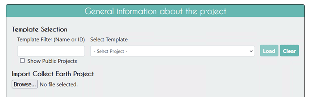
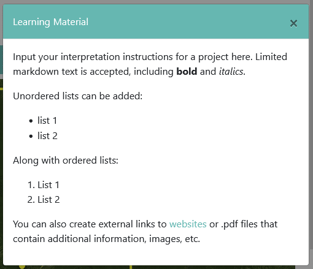
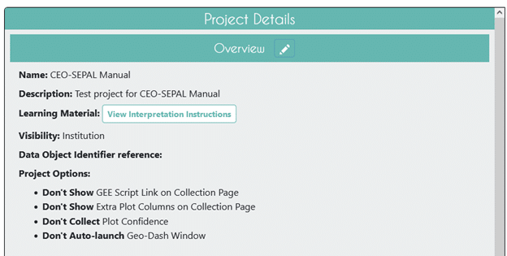

Project Overview
================

This section allows you to add general information about the project, including selecting a template (optional), project name, project description, and project options.

Project Type
------------

The **Project Type** dropdown menu allows you to select the type of project you want to create. The options are:
- **Regular Project**: This is the default option and allows you to create a project with plots and samples. 
- **Simplified Project**: This option allows you to create a streamlined project without pre-defined plots and samples. Users can draw their own plots on the map during data collection. In addition, the survey question types are limited and the data collection interface is simplified. 

Use a **Regular Project** if you want to use the full functionality of CEO, including pre-defined plots and samples, advanced survey question types, and a more complex data collection interface. **Regular Projects** are suitable for projects that require a more structured approach to data collection, such as data collection for national inventories, land use change assessments, or other projects that require a defined sampling design.

Use a **Simplified Project** if you want to create a project that is easier to set up and use, with fewer options and a more straightforward data collection process. **Simplified Projects** are suitable for projects that are looking for flexible user input, such as data collection for machine learning model training and validation. 

For information on how to set up a **Simplified Project**, see :doc:`/project/simplifiedproject`.

.. _templates:

Use a Project Template (Optional)
---------------------------------

This feature is used to copy all the information—including project info, area, and sampling design—from an existing published project to a new project. This is useful if you have an existing project you want to duplicate for another year or location, or if you are iterating through project design. For a template, you may use any available published or closed project from your institution. You cannot use deleted projects. You cannot use another institution’s private project but you can use another institution’s public project (any website visitor or CEO user). For more on project privacy settings, see **Visibility** below.

.. tip::

   If you do not want to copy another project, simply skip this section.

- Click on the **Show Public Projects** checkbox if you would like to view all public projects in CEO that you can use as a template. If you do not check this box, you will only see your institution’s projects.

  .. figure:: ../_images/project3.png
     :alt: Public projects
     :align: center
     :width: 50%

- **Template Filter (Name or ID)**: To filter the projects, type in a keyword in an existing project’s name or the Project ID Number. You can find the Project ID number by navigating to the project you want to copy and looking at the URL.

  .. figure:: ../_images/project4.png
      :alt: Find the project ID
      :align: center
      :width: 50%

- Then click on the dropdown menu under **Select Project** and click on the project’s name.

  .. figure:: ../_images/project5.png
      :alt: Select Prject
      :align: center
      :width: 70%

- When you find the project that you would like to use as a template, click on the project name, then click **Load** to load the template information.
- Click on **Clear** to clear all template information.

 .. note::

    If you select a project under **Select Template**, and then if you clear the project selection the Imagery Preview in the next section may display only gray/white. Change the **Default Imagery** to any other source and then back to the source you are interested in and the basemap will reappear.

- Loading a template will create two checkboxes under **Copy Options**, **Copy Template Plots and Samples** and **Copy Template Widgets**. They are checked by default.

  - If **Copy Template Plots and Samples** is checked, the Plot Review and Sample Design sections will only display an overview of the number of plots, etc. Uncheck this box to change those parameters.
  - **Copy Template Widgets** refers to Geo-Dash options covered in :doc:`geodash`.

Import Collect Earth Project
----------------------------

You can also import an existing Collect Earth desktop project. This is useful if you have a project that was created in the desktop version of Collect Earth and you want to import it into CEO. To do this, click on the **[Browse...]** button located in the **Import Collect Earth Project** section. This will open a new window where you can upload your existing project file. The file should be a .cep file, which is the format used by Collect Earth. Once you have selected the file, click **[OK]** to upload it to CEO. CEO will then import the project and create a new project in your institution with the same name and description as the original project. You can then edit the project as needed.

.. _basic-project-information:

Basic Project Information
-------------------------
This section allows you to enter the project name and description, select the project’s visibility, and select project options.

Name and Description
^^^^^^^^^^^^^^^^^^^^

Enter the project’s **Name** and **Description**.

- The **Name** should be short and will be displayed on the Home page as well as the project’s Data Collection page.
- You should keep the **Description** short but informative. Users will see these if they click on the project’s pin on the map on the home page. You will also see this when you are administering your project.
- If you are using a template, the **Name** and **Description** will automatically be populated. Be sure to change this to reflect your new project.

Learning Material
^^^^^^^^^^^^^^^^^

- The **Learning Material** feature allows project administrators to collect all that information in one handy location! Administrators can use this feature to provide users with quick tips for interpretation, more detailed instructions, and links to external websites and files. The pop-up window is easily accessible to users in the **External Tools** section of the **Data Collection** interface by pressing the **Interpretation Instructions** button.
- The **Learning Material** feature supports basic markdown. For example, the following text can be added to the learning materials field:

.. code-block:: markdown

    Input your interpretation instructions for a project here. 
    Limited markdown text is accepted, including **bold** and *italics*.

    Unordered lists can be added:
    - List 1
    - List 2
    Along with ordered lists:
    1. List 1
    2. List 2
    
    You can also create external links to [websites](collect.earth) 
    or documents or .pdf files that contain additional information, images, etc.

- The text appears as follows to data interpreters when the push the Interpretation Instructions button in the Data Collection interface.

- You can preview the **Learning Material** by using the **[View Interpretation Instructions]** button. This feature can be implemented in existing projects by editing the project and adding text to the **Learning Materials** text box.

.. _visibility:

Visibility
^^^^^^^^^^

The **Privacy Level** radio button changes who can view your project, contribute to data collection, and whether admins from your institution or others creating new projects can use your project as a template.

- **Public: All:** All users can see and contribute data to your project. Admins can use your project as a template.
- **Users: Logged in Users:** Any user logged into CEO can see and contribute to your project. Admins can use your project as a template.
- **Institution: Group Members:** Members of your institution can see and contribute to your project. Admins from other institutions cannot use your project as a template.
- **Private: Group Admins:** Only your Institution’s Admins can see and contribute to your project. Admins from other institutions cannot use your project as a template.

Project Options
^^^^^^^^^^^^^^^

- The first option is **Show GEE Script Link on the Collection page.**

  This allows users in Data Collection to click on a button labeled **[Go to GEE Script]**.

  .. figure:: ../_images/project6-1.png
      :alt: Go to GEE Script button.
      :align: center
      :width: 50%

  This button will take them to a Google Earth Engine website with additional information about the plot. 

  .. figure:: ../_images/project7-0.png
      :alt: The GEE Script page when first loaded.
      :align: center
      :width: 100%

  There are multiple interactive panels. 
  
  .. note::  When the page first loads there will only be two panels of imagery displayed. You will need to select a plot from the vegetation time series graphs on the right hand side of the page to load the imagery in the bottom left and center panels.
  
  In the upper left, there is a Sentinel 2 composite of the last 12 months. It is colored using an infrared color composite (near infrared, mid infrared, red). In the upper center is a Landsat 8 False Color Yearly mosaic. Underneath these are Landsat 5 and Landsat 7 imagery. These plots may not have any images when first loaded. Instead, look at the right hand side of the page. There are five vegetation time series graphs. The top graph is from MODIS, then going down Landsat 5/7/8 NDVI, Sentinel-2 NDVI, Landsat 5/7/8 NDMI, and Sentinel-2 NDMI. Clicking on a point in the graphs will load the corresponding images in the appropriate imagery panels.

   .. figure:: ../_images/project7-1.png
      :alt: The GEE Script page after selecting points on the time series graphs.
      :align: center
      :width: 100%

- The second option is **Show Extra Plot Columns on Collection Page**. This option is only useful if you are using .csv or .shp files to define your **Plot Design**.
    
  If you have additional columns in your .csv or .shp files, such as elevation information or land cover class, data collectors will be able to see them on the **Data Collection** page under **Plot Information**. The columns will be displayed in the same order in which they are included in the .csv or .shp file.

  .. figure:: ../_images/project8.png
      :alt: Plot information
      :align: center
      :width: 50%

- The third option is **Collect Plot Confidence on Collection Page.** If you want users to be able to tell you how certain they are of their answers to the survey questions, the confidence slider will allow them to assign a value 1-100, where 100 is completely confident of their answers; this value applies to the entire plot. This info will be included in your plot and sample CSV downloads.

   .. figure:: ../_images/project9.png
       :alt: Plot confidence slider
       :align: center
       :width: 90%

-  The fourth option is **Auto-launch Geo-Dash.** This will automatically open the Geo-Dash interface in a new window or new tab when the data collector navigates to a new plot. Unchecking this option means that data collectors will need to click on the Geo-Dash icon under **External Tools** in the **Data Collection** interface.

Click **[Next]** when you are finished.
