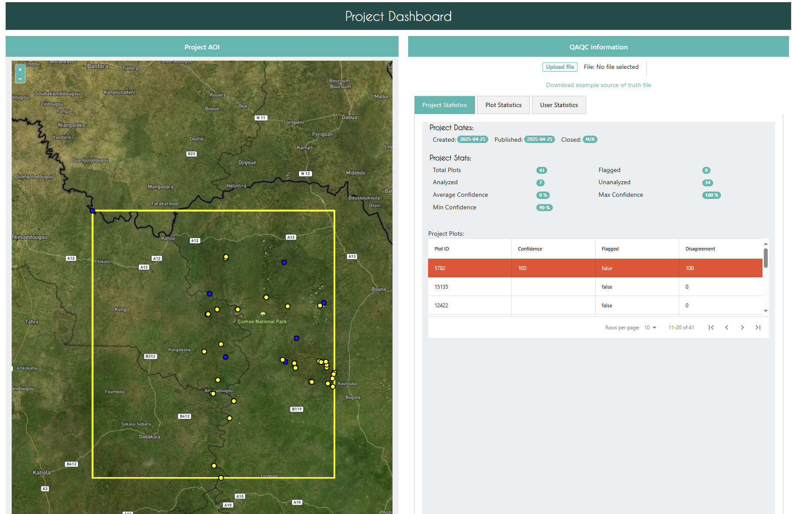
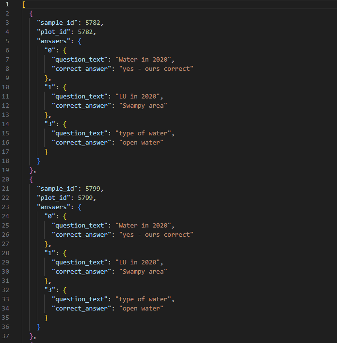
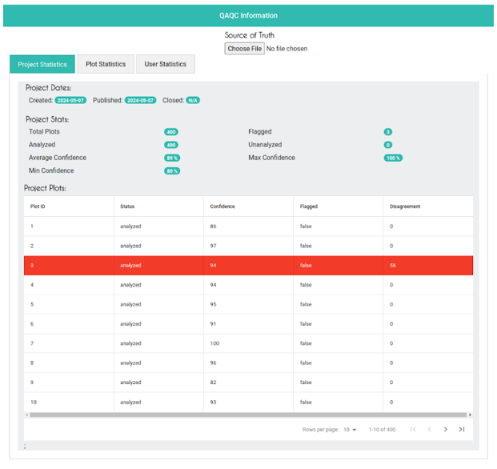
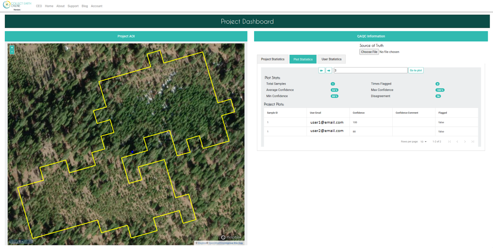
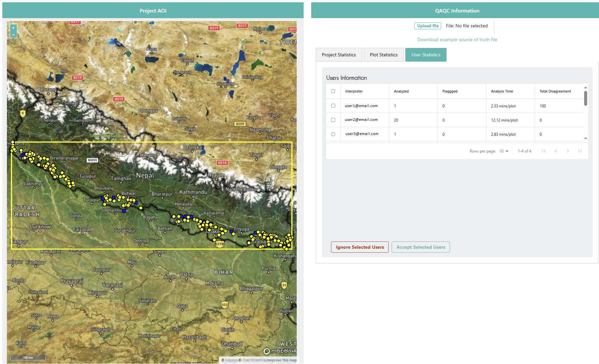

QAQC Dashboard
==============

CEO’s QAQC Dashboard enhances data quality by integrating multiple information streams, including user-collected data and external models and datasets. For example, projects can check user-collected land cover data with the output of an AI model or previous year's data. This approach is sometimes called “convergence of evidence.”

The QAQC Dashboard allows institution administrators to review agreement between users as well as connect an external data stream with specific question(s) in a project’s survey. This functionality improves the quality of data collected in CEO by helping to identify misclassifications early, identify bad actors or poor quality interpretations, facilitate discussion on misunderstandings during data collection workshops, and streamlines reviewer efforts by concentrating on plots that are more likely to be inaccurately classified.

Comparison between the external data and CEO collected data is made by comparing the answers from the external data stream to the user collected data in CEO. The results of this comparison will be shown as an interactive report in the QAQC Dashboard page for the project. 

The dashboard calculates disagreement for survey questions by comparing the answers in the external data stream with the answers provided by the interpreter(s). Disagreement is set to 0 when there is no external data source provided and only one interpretation per plot.

.. note:: Projects with lots of analyzed plots may take about a minute or two to compute.

The Dashboard Interface
-----------------------

There are two main panes in the QAQC Dashboard: **Project AOI** and **QAQC Information**.

The Project AOI pane displays either the entire project area of interest (AOI) or the AOI for a specific plot, depending on which tab is selected in the QAQC Information pane. When the **Project Statistics** tab is selected, the map shows all plots in the project, with red highlights indicating the disagreement between users or users and external data. When the **Plot Statistics** tab is selected, the map zooms in to show only the selected plot. When the **User Statistics** tab is selected, the map shows all plots assigned to the selected user.

The QAQC Information pane contains space to upload a your external data file and three tabs: **Project Statistics**, **Plot Statistics**, and **User Statistics**. Each of these will be described in more detail below.

Uploading External Data
-----------------------

At the top of the QAQC Information pane is a place to upload an external data file. This file should contain the answers to the survey questions that you want to validate with an external dataset.

Currently, the external data stream can be tabular data, including JSON or CSV files. 

The data file should contain an answer for each question that you want to validate with an external dataset for all plots/samples in the project. Tabular datasets will need to include one row for each plot, with columns containing information corresponding to one survey question. For example, suppose you want to validate a question asking if the land cover is forest or non-forest. Your tabular data should have one row for each plot/sample. One of your columns should include the correct answer to this question for each plot/sample. This column will correspond to the survey question in CEO asking data collectors whether the plot is forest/non-forest.

.. note:: In the future, raster datasets will also be able to be used. The end goal will be to connect external model output and datasets from sources including SEPAL and GEE. Currently, tabular datasets can be derived from raster or vector data using a tool like QGIS or GEE. 

You can download an example dataset for your project in JSON format from the QAQC dashboard. You can use this example to create your own external data stream. The example dataset will include the SAMPLEID, PLOTID, the question ID, and the question-answer pairs for each question.

Statistics Tabs
---------------

The Statistics tabs include **Project Statistics**, **Plot Statistics**, and **User Statistics**. These options help institution administrators quickly identify issues with projects. Project Statistics helps to quickly locate plots with high disagreement or that are flagged by data collectors. The Plot Statistics pane provides details about different user’s responses to survey questions, while the User Statistics pane provides details to help identify user’s data contributions and potential bad actors.

Project Statistics
^^^^^^^^^^^^^^^^^^

In the Project Statistics tab of the QAQC module, project administrators get an overview of the project with useful statistics and a table containing details about each plot. First are some general project statistics, including the total number of plots, information about plot confidence, and number of plots that are flagged or have high disagreement. 

For disagreements higher than 50, the row in the table is highlighted in red, for better visualization. Every column is also sortable. Navigate through large projects using the arrows at the bottom of the table.

Plot Statistics
^^^^^^^^^^^^^^^

The **Plot Statistics** tab provides a detailed view of a single plot, including the plot outline and the interpretations from each user. 

The **Plot Statistics** tab starts with plot navigation tools and specific information about the plot, including the number of samples and the disagreement %. Below the plot overview data is a table with more information about the interpretation data, including each user’s answers. 

The table on this page shows information for every interpretation of all the samples available in that plot. Note that for projects in which guest users without CEO accounts can interpret, this feature will not be available.

User Statistics
^^^^^^^^^^^^^^^

By clicking on the User Statistics tab, the administrator can view information about each user participating in the project interpretation. Again, when guests can interpret, this feature will not be available.

The User Statistics tab starts with a list of users and their statistics, including the number of plots they have interpreted, the number of plots they have flagged, and the average disagreement %.

Importantly, the User Statistics tab also includes buttons for the Administrator to Ignore or Accept selected users. This is useful for managing user contributions to the project, including eliminating bad actors or users who are not contributing to the project in a meaningful way. When users are ignored, their data will not be included in downloaded data files and they will not contribute to QAQC statistics.
