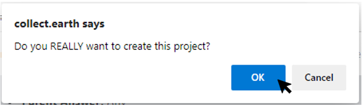

Reviewing Projects
==================

Once the project set up is complete, click on **[Review]** in the bottom right-hand corner.

You will now see an overview of your project details.

Scroll through to check that everything is correct. If everything is correct, click **[Create Project]**. You will need to accept CEO’s terms and conditions.

If you notice a mistake, click **[Continue Editing]** to fix it.

After you click **[Create Project]**, a pop-up window will ask ‘Do you REALLY want to create this project?’ Click **[OK]**.

After you create the project, you will be taken to the **Project Information** interface. 
