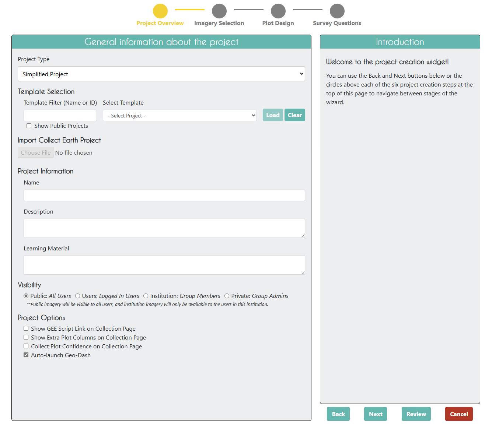
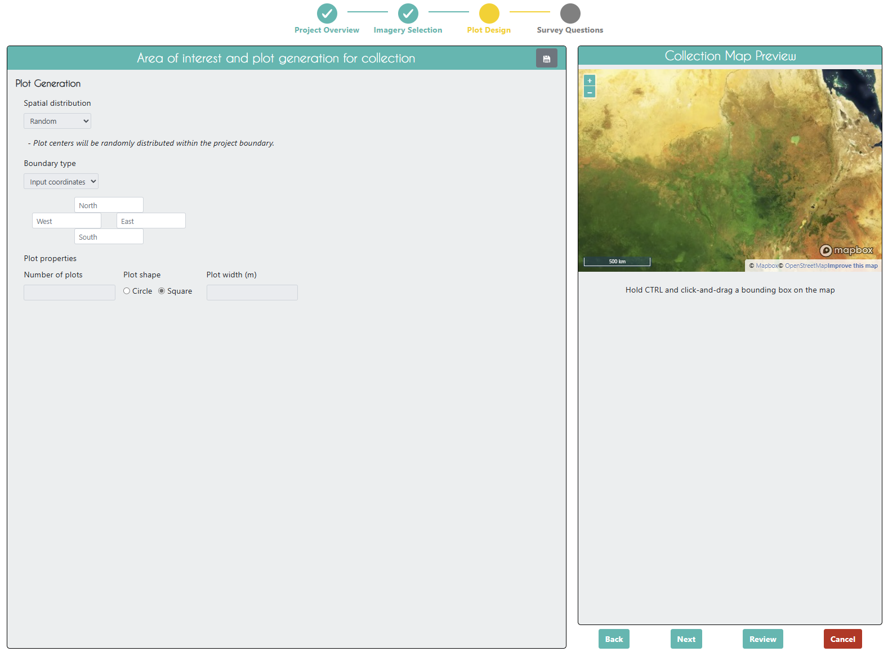
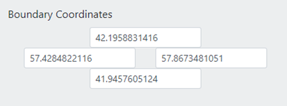
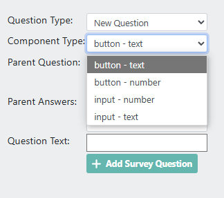

Simplified Projects
===================

Simplified Projects are a new project type in Collect Earth Online that allow you to create projects with fewer steps and less complexity. They are designed for Administrators who want to quickly set up streamlined projects without plots or samples in order to collect user defined data. More information an collecting data in Simplified Projects can be found in the :doc:`/collection/simplified` section.

This project type is useful for collecting training data for machine learning applications, as well as for collecting validation data and feedback on model outputs. It is also useful for collecting data on specific areas of interest without the need for complex sampling designs.

The Simplified Project wizard shares many features with the standard project wizard, but it is simplified to allow for quick setup. The Simplified Project wizard allows you to:
- Provide Project information such as the project name, description, and institution.
- Select imagery from the available options.
- Select an area of interest using a bounding box or a polygon.
- Define the data collection form using a simplified set of questions.

Each of these steps will be described in more detail below.

Please note that Simplified Projects do not support samples, and they do not have the same level of quality control and user assignment features as Standard Projects.

Project Overview
----------------

After you select **Simplified Project** in the **Project Type** dropdown, you will see the Project Wizard change to the Simplified Project interface.

As with Standard Projects, the Simplified Project overview page for Simplified Projects allows you to see the project information, including the project name, and description.

    Project Overview Wizard for a simplified project.

Use a Project Template (Optional)
^^^^^^^^^^^^^^^^^^^^^^^^^^^^^^^^^

Project templates allow you to quickly copy another project's questions and settings. 

.. note:: Simplified Projects can only use other Simplified Projects as templates.

For a template, you may use any available published or closed project from your institution. You cannot use deleted projects. You cannot use another institution’s private project but you can use another institution’s public project. For more on project privacy settings, see `the section on Visibility <visibility>`__.

.. tip::

   If you do not want to copy another project, simply skip this section.

For more information on using templates, see `Project Templates <templates>`__.

Import Collect Earth Project
^^^^^^^^^^^^^^^^^^^^^^^^^^^^

This option is not available for Simplified Projects. If you want to import a Collect Earth project, you will need to create a Standard Project.

Project Information
^^^^^^^^^^^^^^^^^^^

Adding project information to Simplified Projects is similar to adding project information to Standard Projects. 

For more information on adding project information, see `Project Information <basic-project-information>`__.

.. note:: Simplified Projects by default are set to **Public** visibility. If you want to change this, you can do so in the **Visibility** section of the Project Information.

Imagery Selection
-----------------
The Imagery Selection step in the Simplified Project wizard allows you to select the imagery that will be used for data collection. This functionality is identical to the imagery selection in Standard Projects.

For more information on selecting imagery, see :doc:`/project/imageryselection`.

Plot Design
-----------

In Simplified Projects, you do not need to define plots or samples. Instead, you can directly collect data on the area of interest you select.

You will notice that the **Spatial Distribution** section is greyed out in the Simplified Project wizard, as are the **Boundary type, Number of plots, Plot shape, and Plot width (m)** fields.

The only input you will need to provide is the **Area of Interest** bounding box. 

The easiest way to select your project AOI is by drawing a box in the map window in the right hand pane (Collection Map Preview).

 1. Locate your area of interest by zooming in/out using the scroll wheel of your mouse, or the + and – boxes in the map window. You can pan the map by clicking on it and dragging the map window.
 2. Hold the CRTL-key (command key on a Mac) down and draw a box while keeping the left mouse key pressed down.
 3. Hold the SHIFT-key down and draw a box to zoom in.
 4. The coordinate boxes will populate once the box is drawn and you let your mouse key go. Coordinates are displayed in lat/long using **WGS84 EPSG:4326**.

 .. figure:: ../_images/project10.png
       :alt: Draw an AOI box
       :align: center
       :width: 70%

You can also manually enter your Boundary Coordinates into the boxes provided.

Survey Questions
----------------

The Survey Questions step in the Simplified Project wizard allows you to define the data collection form using a simplified set of questions.

Four question types are available in Simplified Projects:
- button - text
- button - number
- input - text
- input - number

While you can add as many questions as you like, we recommend keeping the number of questions to a minimum to ensure a simple data collection process. 

After adding all of your questions, you can click on the **[Review]** button to review your project. If everything looks good, you can click on the **[Create Project]** button to create your Simplified Project. After you create your project, you will be taken to the Project Management page. See the :doc:`/project/management` section for more information on managing your project.