Survey Questions
================

This is where you design the questions that your data collectors/photo interpreters will answer for each of your survey plots. Each question creates a column of data. This raw data facilitates calculating key metrics and indicators and contributes to fulfilling your project goals.

**Survey Cards** are the basic unit of organization. Each survey card creates a page of questions on the Data Collection interface. The basic workflow is: Create new top-level question (new survey card) 🡪 populate answers 🡪 create any child questions & answers 🡪 move to next top-level question (new survey card) & repeat until all questions have been asked.

For the **Survey Question** tab, the left panel allows you to enter questions while the right panel provides a preview of how these questions will appear to your data collectors.

We will now go into more detail about how to add a question and answers, the types of questions that can be asked and when these questions might
be useful.

How to add questions and answers
--------------------------------

CEO provides a straightforward way to ask multiple-choice questions. As the most common question type used, we will use it for this example. In CEO, these questions are called “button—text” questions as in data collection they display as a button with text.

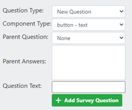

1. To start, type your first question into the **Question Text** box. Since it is your first question, you cannot assign a **Parent Question** or **Parent Answers** for the question.

   .. tip::
       Try to keep the question text below 45 characters so the whole question will be displayed during data collection.

2. Click **[+ Add Survey Question]** to create your first **Survey Card**.
3. You can now add Answers to your question. Answers have two parts: a color and a text box.

   - Click on the **[blue rectangle]** to bring up the **Color Selector.** You can move the color selector dot, use the eyedropper tool, or type in RGB values (0-255). Click off of the color selector when you are done. The color you choose will be associated with the answer. When a data collector selects that answer, any sample points assigned that answer would also be assigned that color to display on the map.

     .. figure:: ../_images/project28.png
         :alt: The color selector
         :align: center
         :width: 50%

   - You can type your answer into the **Text Box**. 
   - Click the green **[+]** symbol to add the answer.
      
     .. tip::
         Try to type questions with less than 45 characters and answers with around 15 characters or less so that the full text is displayed during data collection.

   - Continue adding answers until all the answers to your first survey question have been added.
   - You can also use the **[Bulk Add]** button to add multiple color and answer pairs.

     .. figure:: ../_images/project29.png
         :alt: The bulk answer addition screen
         :align: center
         :width: 40%

   - Now that you have a top-level, or parent, question with answers for your survey card, you can edit and delete questions and answers, as well as add child questions and child questions that appear only when specific answers are chosen.

.. tip:: 
   
    "Button—text" questions are useful for land use and land cover surveys, or anywhere where you want the user to choose between a limited set of mutually exclusive options. 

Delete and edit questions
-------------------------

You can delete or edit your questions and answers after you create them.

- To delete a question or a specific answer, click on the **[Trashcan]** icon next to the question or answer you would like to delete.
- To edit a question or an answer, first type your edits into the box, then click the **[Save]** icon next to the edited question or answer.

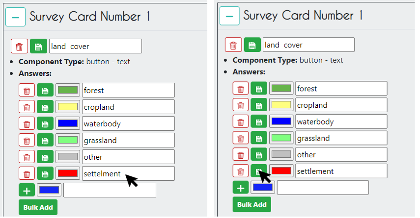

Parent and child questions
--------------------------

You can ask follow-up questions based on a user’s response to further refine information about the plot. For example, if a user categorizes a plot as forest, you can follow up by asking them if it is deciduous or coniferous forest.

You can create extensive lists of land cover classification options for data collection using this approach.

.. tip:: 
    Parent & child questions are useful when you have broad categories and then want to refine the answer within that category.

1. To create a child question, next to **Parent Question** select the question you want using the drop-down menu.
2. You can then assign one or more **Parent Answers** through the dropdown menu. Hold down the **Ctrl** button to select multiple answers. When one of the parent answers is chosen, the child question will appear.

.. tip::
   If you want to have the child question appear regardless of the answer, select all of the answers for **Parent Answer**.

.. note::
   Deleting a parent question with children will delete the children questions as well.

Here is how a survey card with parent/child questions appears on the data collection page initially:

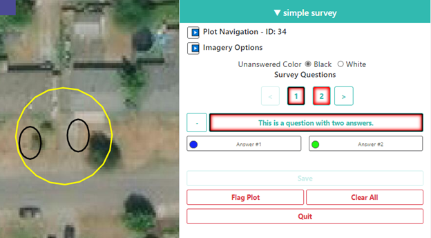

And after selecting “Answer #1”:

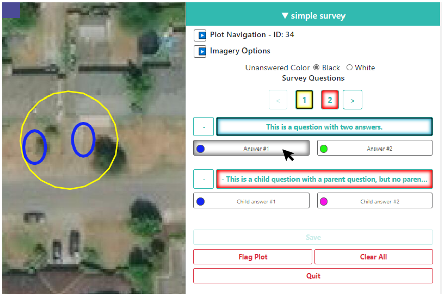

And after selecting “Answer #2”:

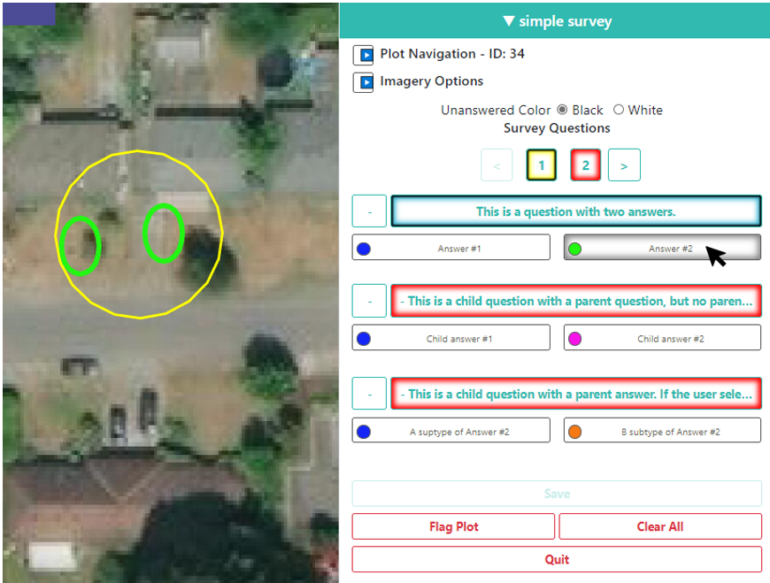

The child question with no parent answer will appear when either answer is selected. The child question with “Answer #2” as the parent answer only appears when “Answer #2” is selected.

You can also see that these questions were too long, and the user cannot read the whole question. Try to keep your question below 45 characters.

When you are done creating child questions, you can create your next survey card by setting the **Parent Question** field to **None** and creating a new question.

Hiding questions and answers
----------------------------

Questions and answers can be hidden using a simple check box. This feature can be used to improve data collection and facilitate downstream analysis. For example, this functionality is useful when you want to use the same survey across multiple projects, but not every question is applicable to every project. This could be the case if you are collecting information on land cover globally, not all areas have the same type of forest so it does not make sense to include these options everywhere. 

Clicking the **[Hide Question]** or **[Hide Answer?]** checkboxes will hide the question or answer during data collection.

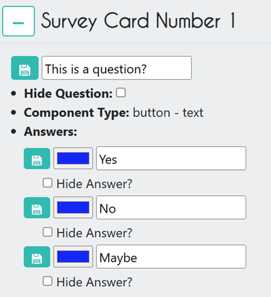

Manipulating the survey cards
-----------------------------

You can collapse a survey card by clicking the **[-]** symbol in the upper left.

You can change the order of the Survey Cards by clicking the **[blue up & down arrows]** in the top right.

Types of survey questions
-------------------------

There are other types of questions that can be created using CEO's survey feature. Below is information about the types of questions and when these questions might be useful.

The **Component Types** include combinations of four question types and three data types.

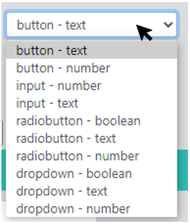

The four question types are:

- **Button**: This creates clickable buttons, allowing users to select one out of many answers for each sample point.
- **Input:** Allows users to enter answers in the box provided. The answer text provided by the project creator becomes the default answer.
- **Radiobutton:** This creates radio buttons, allowing users to select one out of many answers for each sample point.
- **Dropdown:** Allows users to select from a list of answers.

The three data types allowed are:

- **Boolean:** Use this when you have two options for a question (yes/no).
- **Text:** Use this when you have multiple options which are text strings. They may include letters, numbers, or symbols.
- **Number:** Use this when you have multiple options that are numbers,  which do not contain letters or symbols.

For the **Input** type only, you can choose whether to require an answer during data collection.

- Leave this box unchecked if you don’t want users to always collect the information. This is useful for adding optional details about a plot.
- Be sure to check the box if you need the question to be answered.

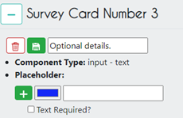

Following are examples of how each question type listed under **Component** Type appears in the **Data Collection** screen, and notes on when each type might be useful.

**Button—text:**

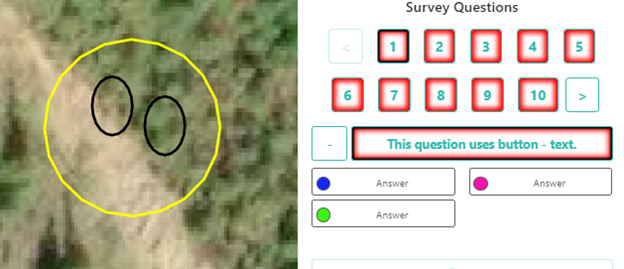

**Button—number:**

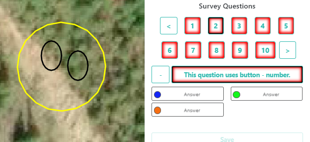

The **Button—number** option, coupled with numeric answers, allows you to implement numeric-only rules that will not work on **Button—text** elements.

.. tip::

    **Button—text** and **Button—number** are useful when you want the user to classify each sample point as one of many different options. Different sample points can be assigned different answers. These are a great option for land use and land cover questions. 

**Input—text:**

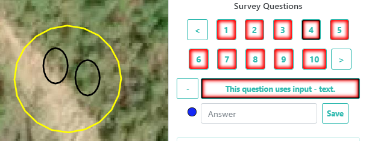

Users can input any character. What the survey creator types in the “Answer” field will become the default text in the input box.

**Input—number:**

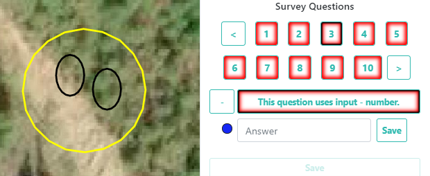

Users can input integers, decimals, negative and positive numbers, and the letter “e” for scientific notation. Decimals must use “.” and not “,”. What the survey creator types in the “Answer” field will become the default text in the input box. Note the user must click “Save” to input the answer.

.. tip:: 
   
    **Input—text** and **Input—number** are useful when you want the user to provide custom input for each plot. For example, you might ask local participants to identify agricultural crops. Answers can be long (500+ characters).

**Radiobutton—boolean:**

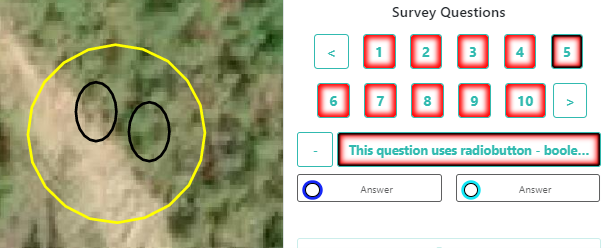

**Radiobutton—text:**

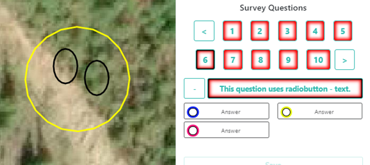

**Radiobutton—number:**

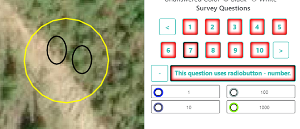

Radiobuttons are functionally much the same as Buttons, but with a different aesthetic and the added Boolean option. You can choose different answers for each sample point. Try to use names with around 15 characters or less so that the full name is displayed during analysis.

.. tip::

    **Radiobuttons** are useful when you want your users to choose one answer for each of your sample points from multiple options. They work well for land use and land cover questions. The Boolean option also works well for areas you want to classify as yes/no, e.g. Forested or Not Forested.

**Dropdown—boolean:**

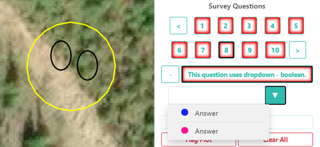

**Dropdown—text:**

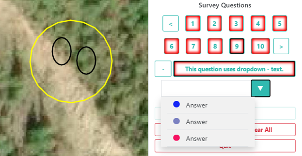

**Dropdown—number:**

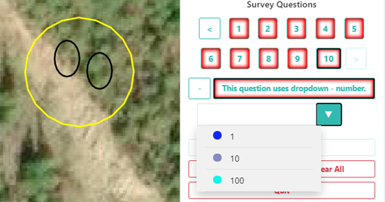

The **Dropdown** questions function similarly to the **Button** and **Radiobutton** options, but with the dropdown menu aesthetic instead of the button aesthetic. As with the other options, you can assign each sample point a different answer, though it is more difficult from a user perspective. 

.. tip::
   
    Dropdowns may encourage assigning only one answer to all the sample points. Overall, choose the option that will be easiest for your users to understand.

Adding Questions to Published Projects
--------------------------------------

If you have a published project that has already had data collected on it, you can add new questions to that project. 

To add new questions to an active project, select **[Edit Project]** and navigate to the **Survey Questions** step in the Project Wizard. You will be able to follow the same process as adding questions during the original project creation to update the survey questions of any type, including child (nested) questions. 

If you would like to make more significant updates to the project, you can also copy the entire project. See :doc:`/project/management`.

.. note::
   When you update an active project, CEO will **not** calculate the project completion percentage. Therefore, if all requirements for the original plots have been met before updating the project, then the project will show as 100% complete.