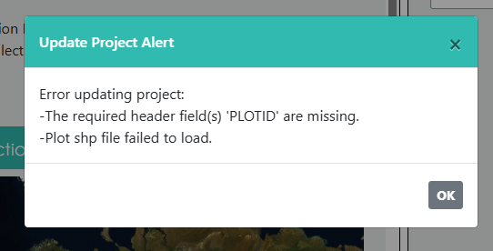

Troubleshooting
===============

Sometimes you might run into problems when creating projects. We detail some of the more common errors here. 

Samples don't end up inside a PLOT when using CSV/SHP/geoJSON files
===================================================================

If you try to create a project uploading your own shapefile, CSV, or geoJSON and the samples are outside of the plot boundary, you will receive an error when you go to create the project. Note that this error occurs if **any** of the samples are outside of the plot boundary. 

**To fix this:**
Update your sample data to ensure all samples are within the plot boundary. If you are using a **Random Spatial Distribution**, you may need to adjust the **Plot width** to ensure it is not larger than the Plot Boundaries. 

Error in plot file (missing column, repeated PLOTID)
====================================================

If you upload your own Plot shapefile, CSV, or geoJSON, and you are missing a required column (PLOTID), or if you have a repeated value for the PLOTID, you will receive an error and be unable to create your project.

Error message if you are missing a field for PLOTID.

.. figure:: ../_images/trouble4.png
    :alt: Error message if PLOTID is repeated
    :align: center
    :width: 50%

Error message if you have a repeated value for a PLOTID.

**To fix this:**
Update your Plot file to include all required columns, or edit/remove any repeated PLOTID's as needed. 

Error in sample file (missing column, repeated SAMPLEID)
========================================================

If you upload your own Sample shapefile, CSV, or geoJSON, and you are missing the required column SAMPLEID, or if you have a repeated value for the SAMPLEID, you will receive an error and be unable to create your project.

.. figure:: ../_images/trouble5.png
    :alt: Error message if SAMPLEID is repeated
    :align: center
    :width: 50%

Error message if you are missing a field for SAMPLEID.

Error message if you have a repeated value for a SAMPLEID.

**To fix this:**
Update your Sample file to include all required columns, or edit/remove any repeated SAMPLEID's as needed. 

Error using non-numeric PLOTID
==============================

If you upload your own shapefile, CSV, or geoJSON, you need to include a PLOTID field. This field must contain numeric values only -- text or alphanumeric entires are not supported. If you try to create a project with text values for PLOTID, you will receive an error during project creation. 

**To fix this:**
Update your file to convert any text or alphanumeric PLOTID's are numeric only. 

Missing plot information
========================

If you try to use a shapefile, CSV, or geoJSON without all of the necessary information, you will receive an error and be unable to create your project.

For example, if you do not have both a LAT and LON field in your CSV, you will receive this error:

**To fix this:**
Review and update your file(s) to ensure you have all of the necessary information.